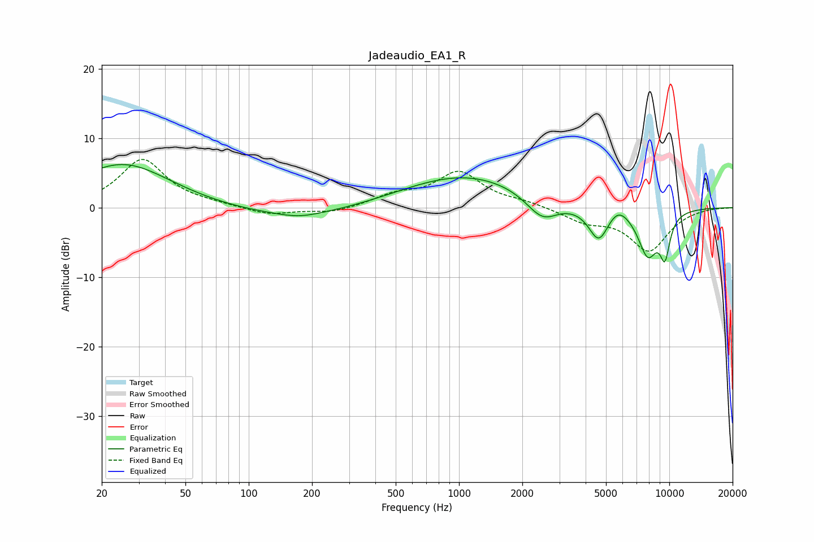

# Jadeaudio_EA1_R
See [usage instructions](https://github.com/jaakkopasanen/AutoEq#usage) for more options and info.

### Parametric EQs
Apply preamp of -6.3 dB when using parametric equalizer.

|   # | Type    |   Fc (Hz) |    Q |   Gain (dB) |
|-----|---------|-----------|------|-------------|
|   1 | Peaking |        25 | 0.63 |         6.4 |
|   2 | Peaking |       174 | 1.48 |        -0.6 |
|   3 | Peaking |       177 | 0.4  |        -1.5 |
|   4 | Peaking |      1068 | 0.45 |         4.8 |
|   5 | Peaking |      2489 | 1.78 |        -3.6 |
|   6 | Peaking |      3048 | 5.63 |         0   |
|   7 | Peaking |      4617 | 2.87 |        -4.9 |
|   8 | Peaking |      5697 | 2.73 |         1.7 |
|   9 | Peaking |      7908 | 2.68 |        -6.6 |
|  10 | Peaking |      9536 | 5.19 |        -5.4 |

### Fixed Band EQs
When using fixed band (also called graphic) equalizer, apply preamp of **-7.0 dB** (if available) and set gains manually with these parameters.

|   # | Type    |   Fc (Hz) |    Q |   Gain (dB) |
|-----|---------|-----------|------|-------------|
|   1 | Peaking |        31 | 1.41 |         6.9 |
|   2 | Peaking |        62 | 1.41 |         0.3 |
|   3 | Peaking |       125 | 1.41 |        -1.1 |
|   4 | Peaking |       250 | 1.41 |        -0.8 |
|   5 | Peaking |       500 | 1.41 |         1.6 |
|   6 | Peaking |      1000 | 1.41 |         4.9 |
|   7 | Peaking |      2000 | 1.41 |         0.7 |
|   8 | Peaking |      4000 | 1.41 |        -1.8 |
|   9 | Peaking |      8000 | 1.41 |        -6.1 |
|  10 | Peaking |     16000 | 1.41 |         0.1 |

### Graphs

