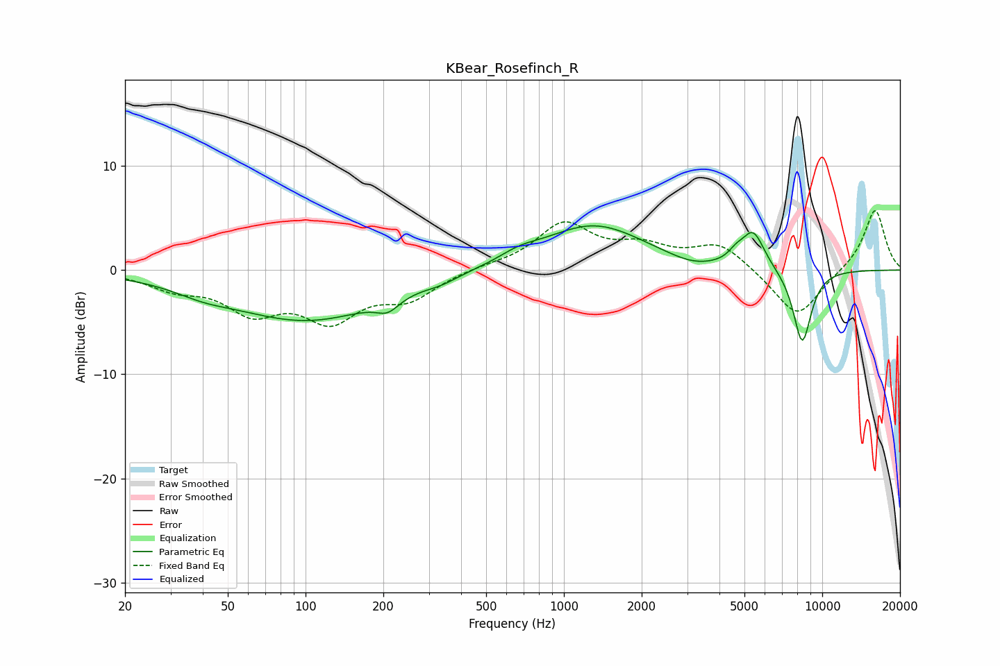

# KBear_Rosefinch_R
See [usage instructions](https://github.com/jaakkopasanen/AutoEq#usage) for more options and info.

### Parametric EQs
Apply preamp of -4.3 dB when using parametric equalizer.

|   # | Type    |   Fc (Hz) |    Q |   Gain (dB) |
|-----|---------|-----------|------|-------------|
|   1 | Peaking |        40 | 1.27 |        -0.7 |
|   2 | Peaking |       101 | 0.47 |        -4.8 |
|   3 | Peaking |       208 | 3.26 |        -1.2 |
|   4 | Peaking |       335 | 2.31 |        -0.4 |
|   5 | Peaking |       669 | 1.88 |         0.7 |
|   6 | Peaking |      1304 | 0.71 |         4.3 |
|   7 | Peaking |      3152 | 1.49 |        -0.7 |
|   8 | Peaking |      4634 | 4.86 |         0.7 |
|   9 | Peaking |      5402 | 3.1  |         3.6 |
|  10 | Peaking |      8367 | 3.58 |        -7.2 |

### Fixed Band EQs
When using fixed band (also called graphic) equalizer, apply preamp of **-5.8 dB** (if available) and set gains manually with these parameters.

|   # | Type    |   Fc (Hz) |    Q |   Gain (dB) |
|-----|---------|-----------|------|-------------|
|   1 | Peaking |        31 | 1.41 |        -1.5 |
|   2 | Peaking |        62 | 1.41 |        -3.6 |
|   3 | Peaking |       125 | 1.41 |        -4.3 |
|   4 | Peaking |       250 | 1.41 |        -2.5 |
|   5 | Peaking |       500 | 1.41 |         0.3 |
|   6 | Peaking |      1000 | 1.41 |         4.3 |
|   7 | Peaking |      2000 | 1.41 |         1.9 |
|   8 | Peaking |      4000 | 1.41 |         2.5 |
|   9 | Peaking |      8000 | 1.41 |        -4.7 |
|  10 | Peaking |     16000 | 1.41 |         5.9 |

### Graphs

