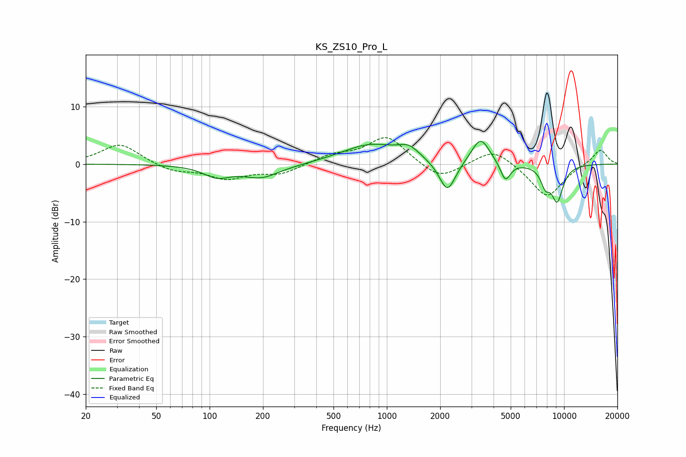

# KS_ZS10_Pro_L
See [usage instructions](https://github.com/jaakkopasanen/AutoEq#usage) for more options and info.

### Parametric EQs
Apply preamp of -4.0 dB when using parametric equalizer.

|   # | Type    |   Fc (Hz) |    Q |   Gain (dB) |
|-----|---------|-----------|------|-------------|
|   1 | Peaking |       110 | 1.9  |        -1.9 |
|   2 | Peaking |       205 | 1.26 |        -3.1 |
|   3 | Peaking |       227 | 1.55 |         0.9 |
|   4 | Peaking |       811 | 0.86 |         3.3 |
|   5 | Peaking |      1331 | 2.4  |         1.8 |
|   6 | Peaking |      2197 | 3.04 |        -5.6 |
|   7 | Peaking |      3377 | 2.73 |         4.6 |
|   8 | Peaking |      4668 | 4.92 |        -3.3 |
|   9 | Peaking |      7842 | 5.07 |        -2.8 |
|  10 | Peaking |      9149 | 3.73 |        -6.1 |

### Fixed Band EQs
When using fixed band (also called graphic) equalizer, apply preamp of **-4.7 dB** (if available) and set gains manually with these parameters.

|   # | Type    |   Fc (Hz) |    Q |   Gain (dB) |
|-----|---------|-----------|------|-------------|
|   1 | Peaking |        31 | 1.41 |         3.6 |
|   2 | Peaking |        62 | 1.41 |        -1.3 |
|   3 | Peaking |       125 | 1.41 |        -2.4 |
|   4 | Peaking |       250 | 1.41 |        -1.7 |
|   5 | Peaking |       500 | 1.41 |         1.4 |
|   6 | Peaking |      1000 | 1.41 |         4.8 |
|   7 | Peaking |      2000 | 1.41 |        -2.9 |
|   8 | Peaking |      4000 | 1.41 |         2.9 |
|   9 | Peaking |      8000 | 1.41 |        -5.9 |
|  10 | Peaking |     16000 | 1.41 |         2.7 |

### Graphs

