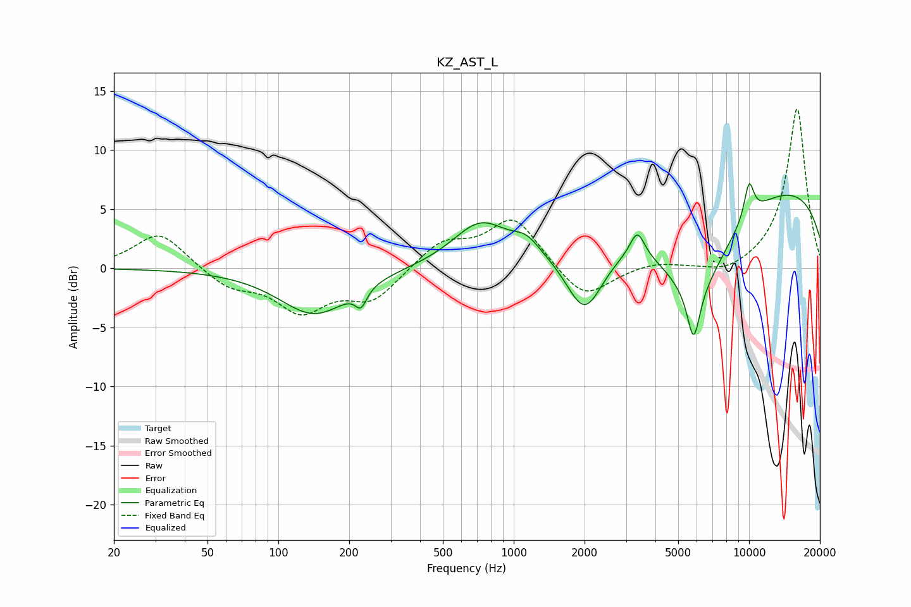

# KZ_AST_L
See [usage instructions](https://github.com/jaakkopasanen/AutoEq#usage) for more options and info.

### Parametric EQs
Apply preamp of -7.3 dB when using parametric equalizer.

|   # | Type    |   Fc (Hz) |    Q |   Gain (dB) |
|-----|---------|-----------|------|-------------|
|   1 | Peaking |       143 | 0.94 |        -3.9 |
|   2 | Peaking |       224 | 5.77 |        -1.5 |
|   3 | Peaking |       720 | 1.21 |         3.5 |
|   4 | Peaking |      1133 | 2.54 |         1.2 |
|   5 | Peaking |      2003 | 1.71 |        -5.9 |
|   6 | Peaking |      3352 | 4.6  |         2.2 |
|   7 | Peaking |      5815 | 5.21 |        -4.4 |
|   8 | Peaking |      5924 | 0.87 |        -8.2 |
|   9 | Peaking |      9956 | 0.18 |         7.6 |
|  10 | Peaking |     10000 | 5.66 |         3   |

### Fixed Band EQs
When using fixed band (also called graphic) equalizer, apply preamp of **-13.6 dB** (if available) and set gains manually with these parameters.

|   # | Type    |   Fc (Hz) |    Q |   Gain (dB) |
|-----|---------|-----------|------|-------------|
|   1 | Peaking |        31 | 1.41 |         3.1 |
|   2 | Peaking |        62 | 1.41 |        -1.6 |
|   3 | Peaking |       125 | 1.41 |        -3.4 |
|   4 | Peaking |       250 | 1.41 |        -2.6 |
|   5 | Peaking |       500 | 1.41 |         2.2 |
|   6 | Peaking |      1000 | 1.41 |         4.2 |
|   7 | Peaking |      2000 | 1.41 |        -2.8 |
|   8 | Peaking |      4000 | 1.41 |         0.5 |
|   9 | Peaking |      8000 | 1.41 |        -0.7 |
|  10 | Peaking |     16000 | 1.41 |        13.6 |

### Graphs

