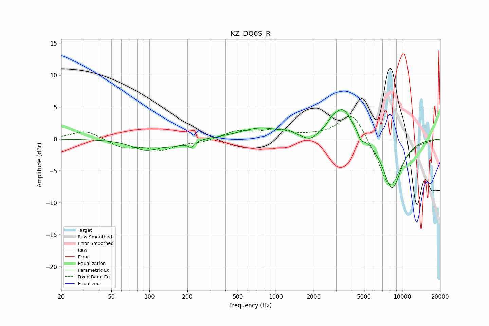

# KZ_DQ6S_R
See [usage instructions](https://github.com/jaakkopasanen/AutoEq#usage) for more options and info.

### Parametric EQs
Apply preamp of -4.7 dB when using parametric equalizer.

|   # | Type    |   Fc (Hz) |    Q |   Gain (dB) |
|-----|---------|-----------|------|-------------|
|   1 | Peaking |        95 | 1.3  |        -1.7 |
|   2 | Peaking |       159 | 2    |        -0.7 |
|   3 | Peaking |       214 | 5.28 |        -1   |
|   4 | Peaking |       762 | 0.86 |         1.7 |
|   5 | Peaking |      1246 | 3.9  |         0.4 |
|   6 | Peaking |      1877 | 2.36 |        -1.1 |
|   7 | Peaking |      2762 | 4.58 |         0.5 |
|   8 | Peaking |      3378 | 1.65 |         5   |
|   9 | Peaking |      4721 | 5.8  |        -1.1 |
|  10 | Peaking |      8335 | 1.72 |        -8   |

### Fixed Band EQs
When using fixed band (also called graphic) equalizer, apply preamp of **-3.6 dB** (if available) and set gains manually with these parameters.

|   # | Type    |   Fc (Hz) |    Q |   Gain (dB) |
|-----|---------|-----------|------|-------------|
|   1 | Peaking |        31 | 1.41 |         1.4 |
|   2 | Peaking |        62 | 1.41 |        -1.3 |
|   3 | Peaking |       125 | 1.41 |        -1.6 |
|   4 | Peaking |       250 | 1.41 |        -0.5 |
|   5 | Peaking |       500 | 1.41 |         1.2 |
|   6 | Peaking |      1000 | 1.41 |         1.2 |
|   7 | Peaking |      2000 | 1.41 |         0.3 |
|   8 | Peaking |      4000 | 1.41 |         4.6 |
|   9 | Peaking |      8000 | 1.41 |        -7.8 |
|  10 | Peaking |     16000 | 1.41 |        -0.1 |

### Graphs

