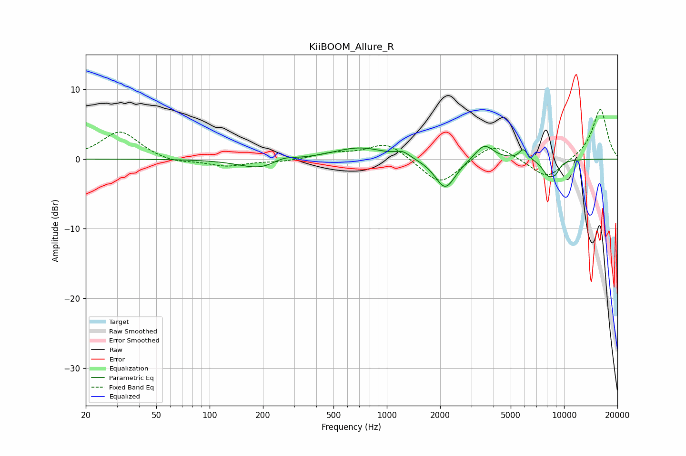

# KiiBOOM_Allure_R
See [usage instructions](https://github.com/jaakkopasanen/AutoEq#usage) for more options and info.

### Parametric EQs
Apply preamp of -1.9 dB when using parametric equalizer.

|   # | Type    |   Fc (Hz) |    Q |   Gain (dB) |
|-----|---------|-----------|------|-------------|
|   1 | Peaking |       196 | 1.18 |        -1.6 |
|   2 | Peaking |       259 | 2.09 |         0.8 |
|   3 | Peaking |       680 | 0.93 |         1.5 |
|   4 | Peaking |       771 | 1.39 |         0.2 |
|   5 | Peaking |      1230 | 3.56 |         0.8 |
|   6 | Peaking |      2137 | 2.43 |        -4.4 |
|   7 | Peaking |      3545 | 2.75 |         2.3 |
|   8 | Peaking |      5901 | 5.76 |         1.5 |
|   9 | Peaking |      8180 | 3.64 |        -2.2 |
|  10 | Peaking |      8963 | 6    |        -1.1 |

### Fixed Band EQs
When using fixed band (also called graphic) equalizer, apply preamp of **-7.2 dB** (if available) and set gains manually with these parameters.

|   # | Type    |   Fc (Hz) |    Q |   Gain (dB) |
|-----|---------|-----------|------|-------------|
|   1 | Peaking |        31 | 1.41 |         4   |
|   2 | Peaking |        62 | 1.41 |        -0.7 |
|   3 | Peaking |       125 | 1.41 |        -1   |
|   4 | Peaking |       250 | 1.41 |        -0.4 |
|   5 | Peaking |       500 | 1.41 |         0.8 |
|   6 | Peaking |      1000 | 1.41 |         2.4 |
|   7 | Peaking |      2000 | 1.41 |        -3.8 |
|   8 | Peaking |      4000 | 1.41 |         2.5 |
|   9 | Peaking |      8000 | 1.41 |        -2.9 |
|  10 | Peaking |     16000 | 1.41 |         7.3 |

### Graphs

