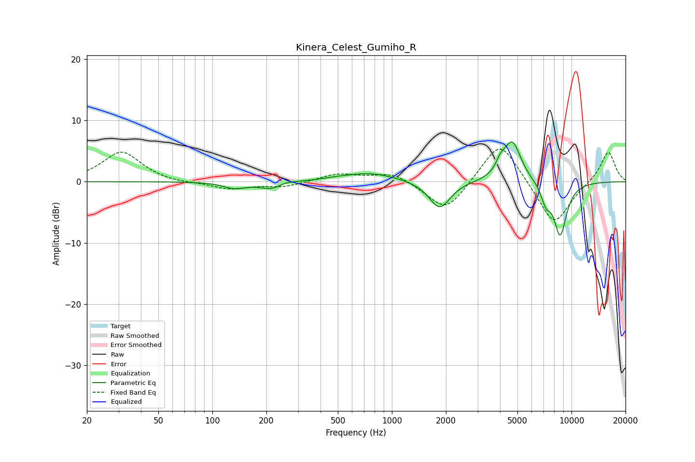

# Kinera_Celest_Gumiho_R
See [usage instructions](https://github.com/jaakkopasanen/AutoEq#usage) for more options and info.

### Parametric EQs
Apply preamp of -6.6 dB when using parametric equalizer.

|   # | Type    |   Fc (Hz) |    Q |   Gain (dB) |
|-----|---------|-----------|------|-------------|
|   1 | Peaking |       133 | 2.33 |        -1   |
|   2 | Peaking |       220 | 2.03 |        -1.5 |
|   3 | Peaking |       249 | 2.58 |         0.8 |
|   4 | Peaking |       486 | 1.82 |         0.2 |
|   5 | Peaking |       757 | 0.97 |         1.4 |
|   6 | Peaking |      1845 | 2.38 |        -4.5 |
|   7 | Peaking |      4026 | 5.72 |         1.5 |
|   8 | Peaking |      4679 | 2.84 |         6.7 |
|   9 | Peaking |      7200 | 5.25 |        -2.6 |
|  10 | Peaking |      8652 | 3.47 |        -8.7 |

### Fixed Band EQs
When using fixed band (also called graphic) equalizer, apply preamp of **-5.4 dB** (if available) and set gains manually with these parameters.

|   # | Type    |   Fc (Hz) |    Q |   Gain (dB) |
|-----|---------|-----------|------|-------------|
|   1 | Peaking |        31 | 1.41 |         4.9 |
|   2 | Peaking |        62 | 1.41 |        -0.3 |
|   3 | Peaking |       125 | 1.41 |        -1.2 |
|   4 | Peaking |       250 | 1.41 |        -0.8 |
|   5 | Peaking |       500 | 1.41 |         1.3 |
|   6 | Peaking |      1000 | 1.41 |         1.6 |
|   7 | Peaking |      2000 | 1.41 |        -5.2 |
|   8 | Peaking |      4000 | 1.41 |         7.2 |
|   9 | Peaking |      8000 | 1.41 |        -7.4 |
|  10 | Peaking |     16000 | 1.41 |         5.1 |

### Graphs

