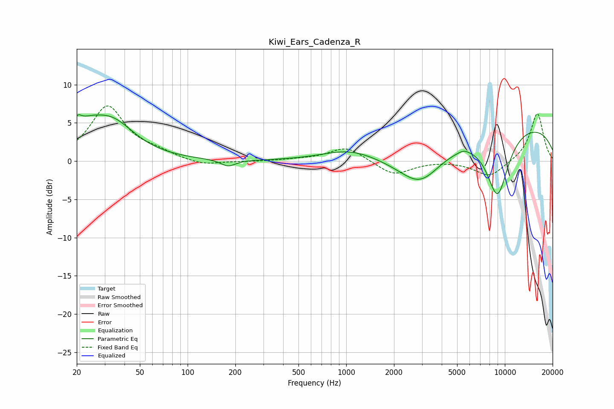

# Kiwi_Ears_Cadenza_R
See [usage instructions](https://github.com/jaakkopasanen/AutoEq#usage) for more options and info.

### Parametric EQs
Apply preamp of -6.2 dB when using parametric equalizer.

|   # | Type    |   Fc (Hz) |    Q |   Gain (dB) |
|-----|---------|-----------|------|-------------|
|   1 | Peaking |        20 | 5.19 |         1.8 |
|   2 | Peaking |        23 | 1.65 |         2   |
|   3 | Peaking |        33 | 0.96 |         4.9 |
|   4 | Peaking |       180 | 3    |        -0.9 |
|   5 | Peaking |      1058 | 0.82 |         1.5 |
|   6 | Peaking |      2805 | 0.59 |        -2.1 |
|   7 | Peaking |      2938 | 1.15 |        -3.4 |
|   8 | Peaking |      5506 | 4.47 |         0.3 |
|   9 | Peaking |      8987 | 1.75 |        -8.7 |
|  10 | Peaking |      9965 | 0.2  |         5.1 |

### Fixed Band EQs
When using fixed band (also called graphic) equalizer, apply preamp of **-7.3 dB** (if available) and set gains manually with these parameters.

|   # | Type    |   Fc (Hz) |    Q |   Gain (dB) |
|-----|---------|-----------|------|-------------|
|   1 | Peaking |        31 | 1.41 |         7.1 |
|   2 | Peaking |        62 | 1.41 |         0.9 |
|   3 | Peaking |       125 | 1.41 |        -0.6 |
|   4 | Peaking |       250 | 1.41 |        -0.1 |
|   5 | Peaking |       500 | 1.41 |         0.2 |
|   6 | Peaking |      1000 | 1.41 |         1.9 |
|   7 | Peaking |      2000 | 1.41 |        -1.9 |
|   8 | Peaking |      4000 | 1.41 |         0.1 |
|   9 | Peaking |      8000 | 1.41 |        -2.1 |
|  10 | Peaking |     16000 | 1.41 |         6.3 |

### Graphs

