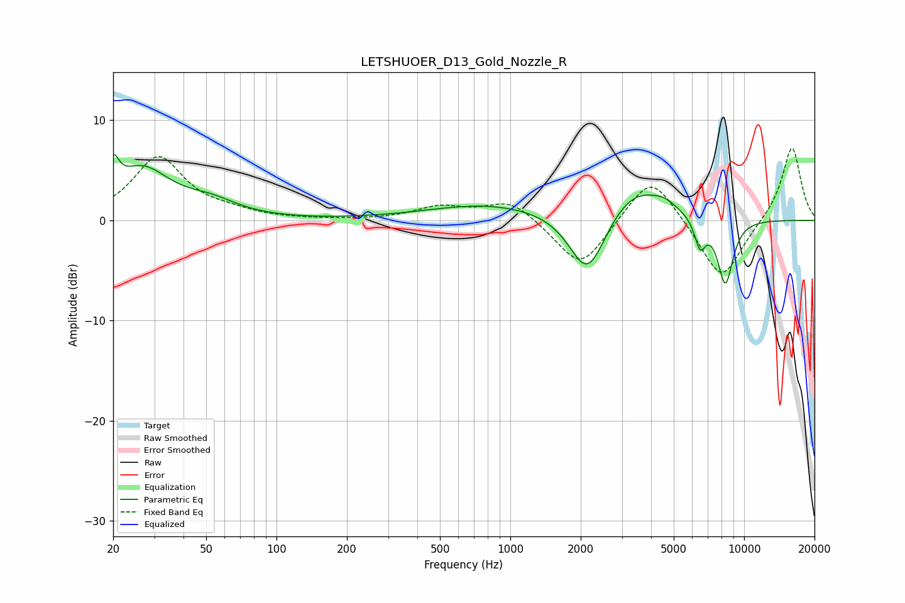

# LETSHUOER_D13_Gold_Nozzle_R
See [usage instructions](https://github.com/jaakkopasanen/AutoEq#usage) for more options and info.

### Parametric EQs
Apply preamp of -6.6 dB when using parametric equalizer.

|   # | Type    |   Fc (Hz) |    Q |   Gain (dB) |
|-----|---------|-----------|------|-------------|
|   1 | Peaking |        20 | 5.93 |         3   |
|   2 | Peaking |        26 | 1.17 |         4.9 |
|   3 | Peaking |        52 | 1.22 |         1.4 |
|   4 | Peaking |       800 | 0.55 |         1.5 |
|   5 | Peaking |      2107 | 1.86 |        -5   |
|   6 | Peaking |      2259 | 1.81 |        -1.7 |
|   7 | Peaking |      3439 | 1.02 |         3.6 |
|   8 | Peaking |      4590 | 3.29 |         0.5 |
|   9 | Peaking |      6484 | 5.7  |        -2.9 |
|  10 | Peaking |      8309 | 3.82 |        -6.6 |

### Fixed Band EQs
When using fixed band (also called graphic) equalizer, apply preamp of **-7.3 dB** (if available) and set gains manually with these parameters.

|   # | Type    |   Fc (Hz) |    Q |   Gain (dB) |
|-----|---------|-----------|------|-------------|
|   1 | Peaking |        31 | 1.41 |         6.2 |
|   2 | Peaking |        62 | 1.41 |         0.6 |
|   3 | Peaking |       125 | 1.41 |         0   |
|   4 | Peaking |       250 | 1.41 |         0   |
|   5 | Peaking |       500 | 1.41 |         1.3 |
|   6 | Peaking |      1000 | 1.41 |         2.1 |
|   7 | Peaking |      2000 | 1.41 |        -5   |
|   8 | Peaking |      4000 | 1.41 |         5   |
|   9 | Peaking |      8000 | 1.41 |        -6.2 |
|  10 | Peaking |     16000 | 1.41 |         7.5 |

### Graphs

