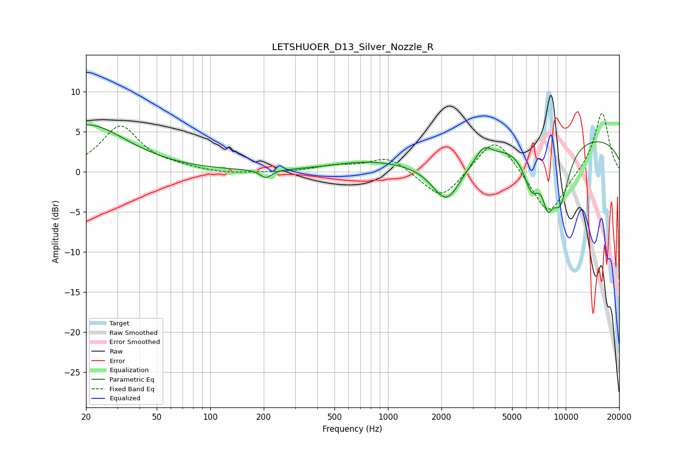

# LETSHUOER_D13_Silver_Nozzle_R
See [usage instructions](https://github.com/jaakkopasanen/AutoEq#usage) for more options and info.

### Parametric EQs
Apply preamp of -5.9 dB when using parametric equalizer.

|   # | Type    |   Fc (Hz) |    Q |   Gain (dB) |
|-----|---------|-----------|------|-------------|
|   1 | Peaking |        20 | 0.63 |         5.8 |
|   2 | Peaking |       206 | 4.42 |        -1   |
|   3 | Peaking |       745 | 0.71 |         1   |
|   4 | Peaking |      2143 | 1.66 |        -5.6 |
|   5 | Peaking |      3442 | 3.75 |         1.4 |
|   6 | Peaking |      6422 | 2.89 |        -3.1 |
|   7 | Peaking |      6456 | 3.15 |        -1.6 |
|   8 | Peaking |      7924 | 4.35 |        -4.3 |
|   9 | Peaking |      9286 | 2.35 |        -7.3 |
|  10 | Peaking |     10000 | 0.19 |         4.6 |

### Fixed Band EQs
When using fixed band (also called graphic) equalizer, apply preamp of **-7.4 dB** (if available) and set gains manually with these parameters.

|   # | Type    |   Fc (Hz) |    Q |   Gain (dB) |
|-----|---------|-----------|------|-------------|
|   1 | Peaking |        31 | 1.41 |         5.6 |
|   2 | Peaking |        62 | 1.41 |         0.4 |
|   3 | Peaking |       125 | 1.41 |        -0.3 |
|   4 | Peaking |       250 | 1.41 |        -0.1 |
|   5 | Peaking |       500 | 1.41 |         0.7 |
|   6 | Peaking |      1000 | 1.41 |         1.9 |
|   7 | Peaking |      2000 | 1.41 |        -3.7 |
|   8 | Peaking |      4000 | 1.41 |         4.7 |
|   9 | Peaking |      8000 | 1.41 |        -5.7 |
|  10 | Peaking |     16000 | 1.41 |         7.6 |

### Graphs

