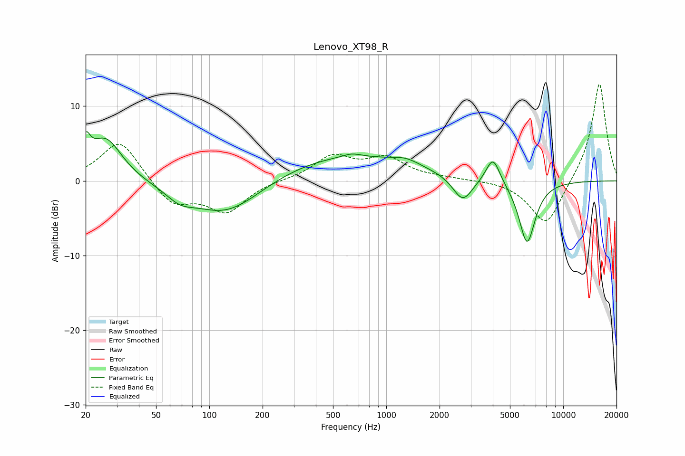

# Lenovo_XT98_R
See [usage instructions](https://github.com/jaakkopasanen/AutoEq#usage) for more options and info.

### Parametric EQs
Apply preamp of -6.7 dB when using parametric equalizer.

|   # | Type    |   Fc (Hz) |    Q |   Gain (dB) |
|-----|---------|-----------|------|-------------|
|   1 | Peaking |        20 | 5.64 |         3.3 |
|   2 | Peaking |        26 | 1.51 |         5.8 |
|   3 | Peaking |        68 | 1.9  |        -1.4 |
|   4 | Peaking |       125 | 0.69 |        -4.9 |
|   5 | Peaking |       557 | 0.35 |         3.5 |
|   6 | Peaking |       639 | 2.88 |         0.5 |
|   7 | Peaking |      1292 | 1.82 |         0.8 |
|   8 | Peaking |      2704 | 2.53 |        -3.4 |
|   9 | Peaking |      4008 | 3.54 |         3.6 |
|  10 | Peaking |      6245 | 2.92 |        -8.5 |

### Fixed Band EQs
When using fixed band (also called graphic) equalizer, apply preamp of **-13.0 dB** (if available) and set gains manually with these parameters.

|   # | Type    |   Fc (Hz) |    Q |   Gain (dB) |
|-----|---------|-----------|------|-------------|
|   1 | Peaking |        31 | 1.41 |         5.6 |
|   2 | Peaking |        62 | 1.41 |        -3.3 |
|   3 | Peaking |       125 | 1.41 |        -4   |
|   4 | Peaking |       250 | 1.41 |         0.1 |
|   5 | Peaking |       500 | 1.41 |         3.2 |
|   6 | Peaking |      1000 | 1.41 |         2.8 |
|   7 | Peaking |      2000 | 1.41 |         0.3 |
|   8 | Peaking |      4000 | 1.41 |         0.1 |
|   9 | Peaking |      8000 | 1.41 |        -6.2 |
|  10 | Peaking |     16000 | 1.41 |        13.3 |

### Graphs

