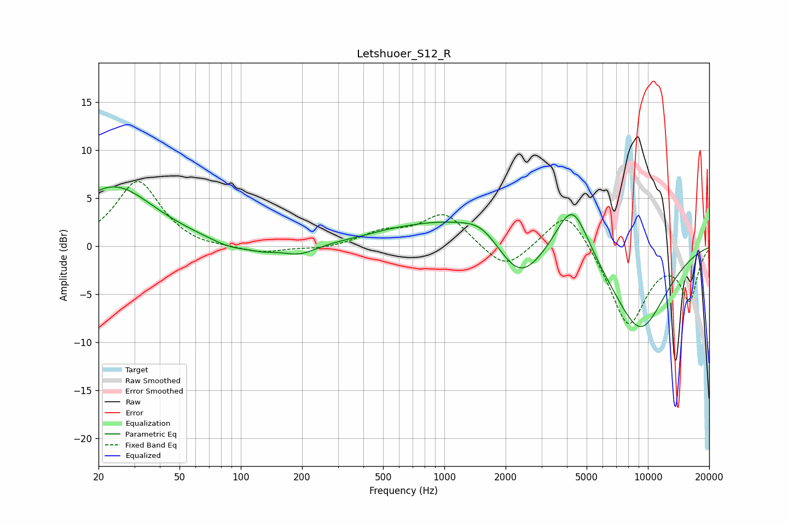

# Letshuoer_S12_R
See [usage instructions](https://github.com/jaakkopasanen/AutoEq#usage) for more options and info.

### Parametric EQs
Apply preamp of -6.3 dB when using parametric equalizer.

|   # | Type    |   Fc (Hz) |    Q |   Gain (dB) |
|-----|---------|-----------|------|-------------|
|   1 | Peaking |        24 | 0.72 |         6.2 |
|   2 | Peaking |        89 | 1.51 |        -0.8 |
|   3 | Peaking |       128 | 2.01 |        -0.5 |
|   4 | Peaking |       194 | 1.67 |        -1.1 |
|   5 | Peaking |       519 | 1.48 |         0.1 |
|   6 | Peaking |      1060 | 0.5  |         2.8 |
|   7 | Peaking |      1524 | 1.67 |         1.3 |
|   8 | Peaking |      2350 | 1.23 |        -4.6 |
|   9 | Peaking |      4256 | 1.68 |         6.1 |
|  10 | Peaking |      9093 | 0.89 |        -8.8 |

### Fixed Band EQs
When using fixed band (also called graphic) equalizer, apply preamp of **-6.8 dB** (if available) and set gains manually with these parameters.

|   # | Type    |   Fc (Hz) |    Q |   Gain (dB) |
|-----|---------|-----------|------|-------------|
|   1 | Peaking |        31 | 1.41 |         6.8 |
|   2 | Peaking |        62 | 1.41 |        -0.3 |
|   3 | Peaking |       125 | 1.41 |        -0.8 |
|   4 | Peaking |       250 | 1.41 |        -0.3 |
|   5 | Peaking |       500 | 1.41 |         1.3 |
|   6 | Peaking |      1000 | 1.41 |         3.4 |
|   7 | Peaking |      2000 | 1.41 |        -2.7 |
|   8 | Peaking |      4000 | 1.41 |         4.4 |
|   9 | Peaking |      8000 | 1.41 |        -8.3 |
|  10 | Peaking |     16000 | 1.41 |        -5.3 |

### Graphs

