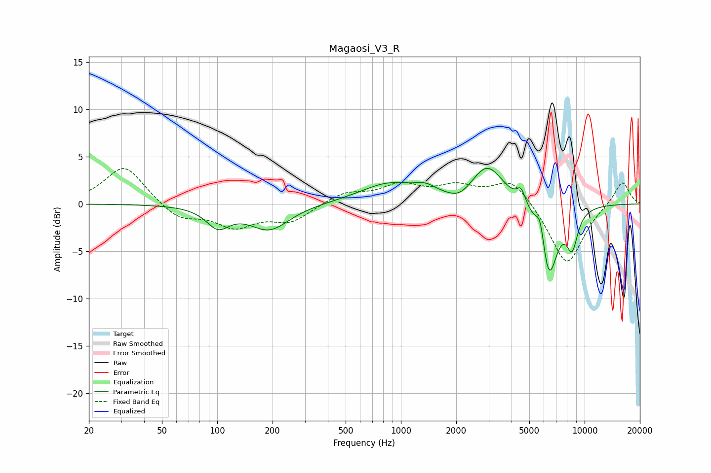

# Magaosi_V3_R
See [usage instructions](https://github.com/jaakkopasanen/AutoEq#usage) for more options and info.

### Parametric EQs
Apply preamp of -3.9 dB when using parametric equalizer.

|   # | Type    |   Fc (Hz) |    Q |   Gain (dB) |
|-----|---------|-----------|------|-------------|
|   1 | Peaking |       101 | 2.27 |        -2.1 |
|   2 | Peaking |       192 | 1.29 |        -2.7 |
|   3 | Peaking |       865 | 0.89 |         2.1 |
|   4 | Peaking |      1362 | 2.47 |         0.8 |
|   5 | Peaking |      2102 | 2.14 |        -1   |
|   6 | Peaking |      2947 | 1.59 |         4.1 |
|   7 | Peaking |      4512 | 6    |         1.5 |
|   8 | Peaking |      5739 | 6    |         2.7 |
|   9 | Peaking |      6377 | 2.87 |        -7.9 |
|  10 | Peaking |      8555 | 4.15 |        -3.8 |

### Fixed Band EQs
When using fixed band (also called graphic) equalizer, apply preamp of **-3.8 dB** (if available) and set gains manually with these parameters.

|   # | Type    |   Fc (Hz) |    Q |   Gain (dB) |
|-----|---------|-----------|------|-------------|
|   1 | Peaking |        31 | 1.41 |         4.1 |
|   2 | Peaking |        62 | 1.41 |        -1.7 |
|   3 | Peaking |       125 | 1.41 |        -2.2 |
|   4 | Peaking |       250 | 1.41 |        -1.8 |
|   5 | Peaking |       500 | 1.41 |         1.2 |
|   6 | Peaking |      1000 | 1.41 |         1.8 |
|   7 | Peaking |      2000 | 1.41 |         1.6 |
|   8 | Peaking |      4000 | 1.41 |         2.7 |
|   9 | Peaking |      8000 | 1.41 |        -6.6 |
|  10 | Peaking |     16000 | 1.41 |         2.5 |

### Graphs

