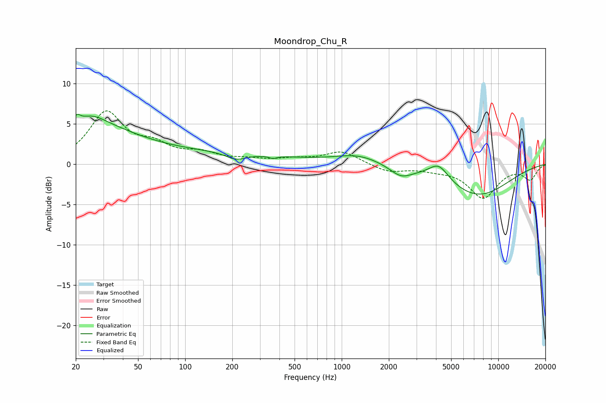

# Moondrop_Chu_R
See [usage instructions](https://github.com/jaakkopasanen/AutoEq#usage) for more options and info.

### Parametric EQs
Apply preamp of -6.3 dB when using parametric equalizer.

|   # | Type    |   Fc (Hz) |    Q |   Gain (dB) |
|-----|---------|-----------|------|-------------|
|   1 | Peaking |        20 | 5.87 |         1.2 |
|   2 | Peaking |        25 | 1.62 |         1.4 |
|   3 | Peaking |        26 | 0.56 |         3.7 |
|   4 | Peaking |       116 | 0.22 |         1.4 |
|   5 | Peaking |       212 | 2.13 |        -0.9 |
|   6 | Peaking |       364 | 5.99 |        -0.3 |
|   7 | Peaking |      1275 | 0.97 |         1.1 |
|   8 | Peaking |      2392 | 1.99 |        -1.3 |
|   9 | Peaking |      4167 | 2.22 |         2   |
|  10 | Peaking |      7327 | 0.63 |        -3.9 |

### Fixed Band EQs
When using fixed band (also called graphic) equalizer, apply preamp of **-6.7 dB** (if available) and set gains manually with these parameters.

|   # | Type    |   Fc (Hz) |    Q |   Gain (dB) |
|-----|---------|-----------|------|-------------|
|   1 | Peaking |        31 | 1.41 |         6.2 |
|   2 | Peaking |        62 | 1.41 |         1.9 |
|   3 | Peaking |       125 | 1.41 |         1.1 |
|   4 | Peaking |       250 | 1.41 |         0.4 |
|   5 | Peaking |       500 | 1.41 |         0.5 |
|   6 | Peaking |      1000 | 1.41 |         1.6 |
|   7 | Peaking |      2000 | 1.41 |        -1   |
|   8 | Peaking |      4000 | 1.41 |        -0.5 |
|   9 | Peaking |      8000 | 1.41 |        -4.1 |
|  10 | Peaking |     16000 | 1.41 |        -1.8 |

### Graphs

