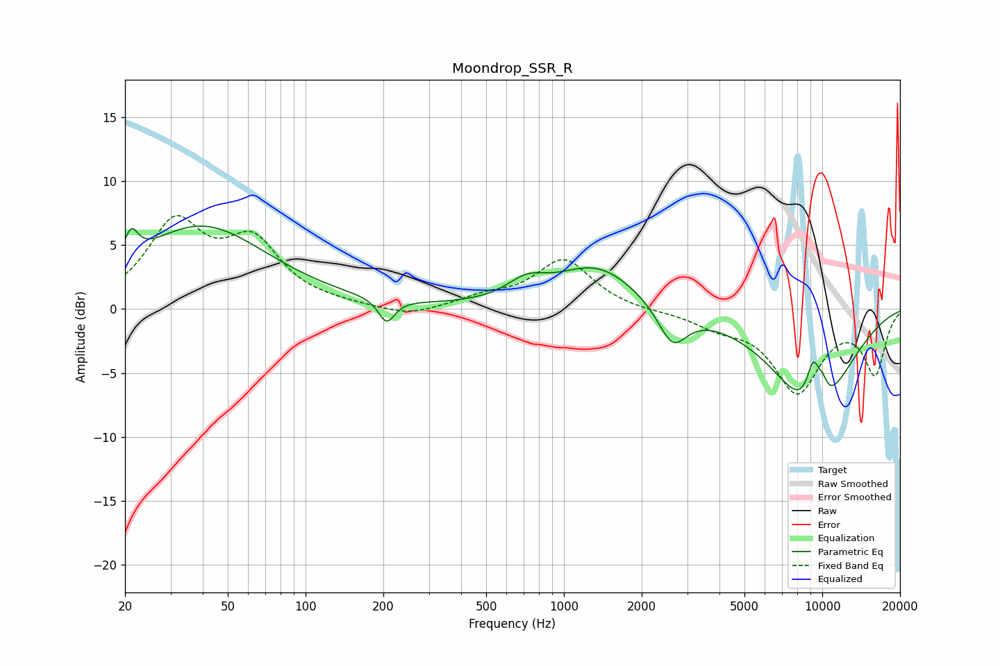

# Moondrop_SSR_R
See [usage instructions](https://github.com/jaakkopasanen/AutoEq#usage) for more options and info.

### Parametric EQs
Apply preamp of -6.6 dB when using parametric equalizer.

|   # | Type    |   Fc (Hz) |    Q |   Gain (dB) |
|-----|---------|-----------|------|-------------|
|   1 | Peaking |        21 | 5.44 |         2.1 |
|   2 | Peaking |        40 | 0.55 |         6.4 |
|   3 | Peaking |       206 | 4.53 |        -1.9 |
|   4 | Peaking |       716 | 1.89 |         1.4 |
|   5 | Peaking |      1342 | 0.89 |         3.4 |
|   6 | Peaking |      2631 | 2.51 |        -3.1 |
|   7 | Peaking |      9255 | 0.85 |        -8.4 |
|   8 | Peaking |      9264 | 4.28 |         4.1 |
|   9 | Peaking |      9744 | 5.45 |        -0.6 |
|  10 | Peaking |     10000 | 5.98 |         1.4 |

### Fixed Band EQs
When using fixed band (also called graphic) equalizer, apply preamp of **-7.4 dB** (if available) and set gains manually with these parameters.

|   # | Type    |   Fc (Hz) |    Q |   Gain (dB) |
|-----|---------|-----------|------|-------------|
|   1 | Peaking |        31 | 1.41 |         6.4 |
|   2 | Peaking |        62 | 1.41 |         4.8 |
|   3 | Peaking |       125 | 1.41 |         0.2 |
|   4 | Peaking |       250 | 1.41 |        -0.7 |
|   5 | Peaking |       500 | 1.41 |         0.8 |
|   6 | Peaking |      1000 | 1.41 |         3.8 |
|   7 | Peaking |      2000 | 1.41 |        -0.2 |
|   8 | Peaking |      4000 | 1.41 |        -1.1 |
|   9 | Peaking |      8000 | 1.41 |        -6.3 |
|  10 | Peaking |     16000 | 1.41 |        -4.9 |

### Graphs

