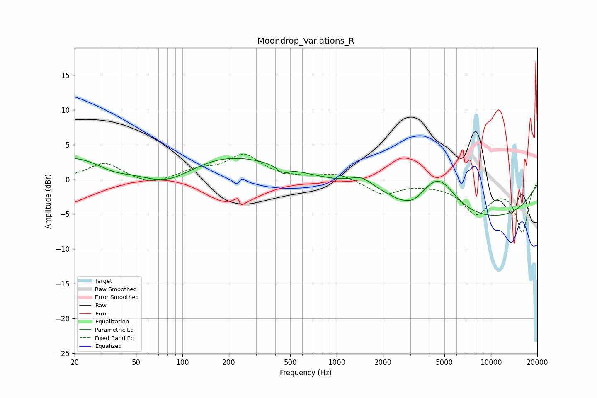

# Moondrop_Variations_R
See [usage instructions](https://github.com/jaakkopasanen/AutoEq#usage) for more options and info.

### Parametric EQs
Apply preamp of -3.1 dB when using parametric equalizer.

|   # | Type    |   Fc (Hz) |    Q |   Gain (dB) |
|-----|---------|-----------|------|-------------|
|   1 | Peaking |        35 | 1.03 |        -2.2 |
|   2 | Peaking |        66 | 0.19 |         6.6 |
|   3 | Peaking |        77 | 0.63 |        -6.1 |
|   4 | Peaking |       448 | 4.53 |        -1   |
|   5 | Peaking |      1457 | 1.82 |         1.6 |
|   6 | Peaking |      2522 | 3.95 |        -0.3 |
|   7 | Peaking |      3119 | 2.09 |        -1.3 |
|   8 | Peaking |      4508 | 1.19 |         5   |
|   9 | Peaking |      4851 | 1.81 |         0.5 |
|  10 | Peaking |      7771 | 0.24 |        -6   |

### Fixed Band EQs
When using fixed band (also called graphic) equalizer, apply preamp of **-3.7 dB** (if available) and set gains manually with these parameters.

|   # | Type    |   Fc (Hz) |    Q |   Gain (dB) |
|-----|---------|-----------|------|-------------|
|   1 | Peaking |        31 | 1.41 |         2.4 |
|   2 | Peaking |        62 | 1.41 |        -0.9 |
|   3 | Peaking |       125 | 1.41 |         1.2 |
|   4 | Peaking |       250 | 1.41 |         3.4 |
|   5 | Peaking |       500 | 1.41 |         0.1 |
|   6 | Peaking |      1000 | 1.41 |         0.9 |
|   7 | Peaking |      2000 | 1.41 |        -2.1 |
|   8 | Peaking |      4000 | 1.41 |        -0.3 |
|   9 | Peaking |      8000 | 1.41 |        -4.6 |
|  10 | Peaking |     16000 | 1.41 |        -7.4 |

### Graphs

