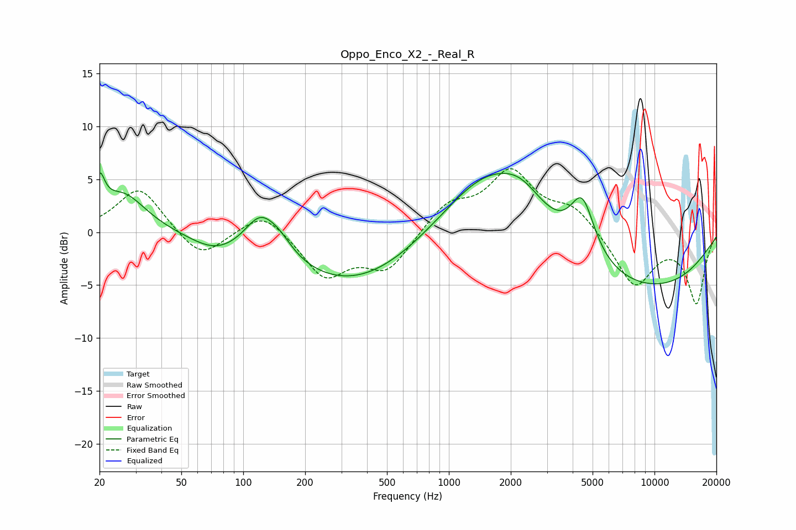

# Oppo_Enco_X2_-_Real_R
See [usage instructions](https://github.com/jaakkopasanen/AutoEq#usage) for more options and info.

### Parametric EQs
Apply preamp of -5.7 dB when using parametric equalizer.

|   # | Type    |   Fc (Hz) |    Q |   Gain (dB) |
|-----|---------|-----------|------|-------------|
|   1 | Peaking |        20 | 5.83 |         3.2 |
|   2 | Peaking |        26 | 1.27 |         3.7 |
|   3 | Peaking |        73 | 1.21 |        -1.3 |
|   4 | Peaking |       121 | 1.87 |         3.2 |
|   5 | Peaking |       149 | 2.04 |         1.5 |
|   6 | Peaking |       344 | 0.42 |        -5.1 |
|   7 | Peaking |      1565 | 0.62 |         6.7 |
|   8 | Peaking |      2266 | 1.41 |         1.9 |
|   9 | Peaking |      4457 | 2.35 |         5.4 |
|  10 | Peaking |      8491 | 0.32 |        -5.5 |

### Fixed Band EQs
When using fixed band (also called graphic) equalizer, apply preamp of **-6.1 dB** (if available) and set gains manually with these parameters.

|   # | Type    |   Fc (Hz) |    Q |   Gain (dB) |
|-----|---------|-----------|------|-------------|
|   1 | Peaking |        31 | 1.41 |         4.3 |
|   2 | Peaking |        62 | 1.41 |        -2.7 |
|   3 | Peaking |       125 | 1.41 |         2.2 |
|   4 | Peaking |       250 | 1.41 |        -4.1 |
|   5 | Peaking |       500 | 1.41 |        -3.5 |
|   6 | Peaking |      1000 | 1.41 |         2.6 |
|   7 | Peaking |      2000 | 1.41 |         5.5 |
|   8 | Peaking |      4000 | 1.41 |         2.2 |
|   9 | Peaking |      8000 | 1.41 |        -5.1 |
|  10 | Peaking |     16000 | 1.41 |        -6.6 |

### Graphs

