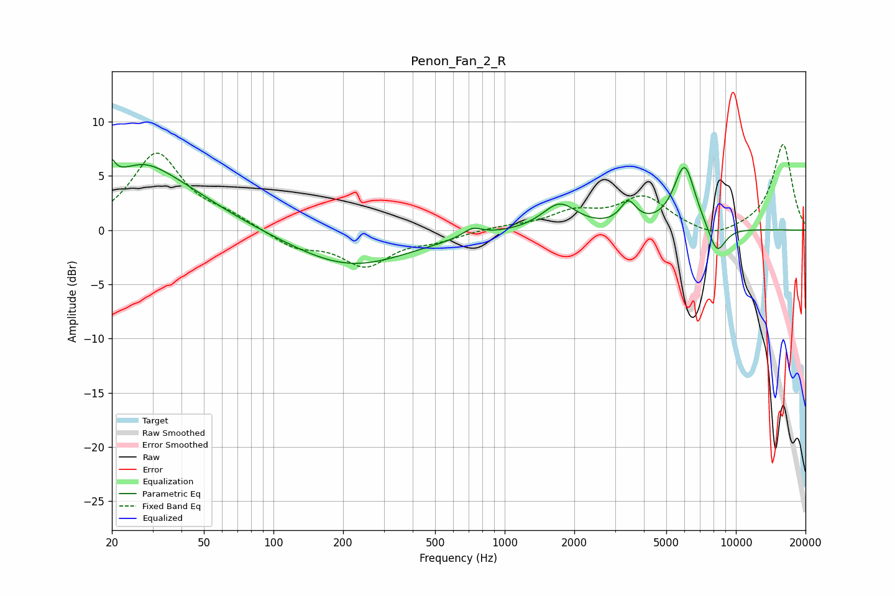

# Penon_Fan_2_R
See [usage instructions](https://github.com/jaakkopasanen/AutoEq#usage) for more options and info.

### Parametric EQs
Apply preamp of -6.6 dB when using parametric equalizer.

|   # | Type    |   Fc (Hz) |    Q |   Gain (dB) |
|-----|---------|-----------|------|-------------|
|   1 | Peaking |        20 | 5.96 |         5.1 |
|   2 | Peaking |        20 | 6    |        -3.3 |
|   3 | Peaking |        27 | 1.46 |         1.2 |
|   4 | Peaking |        29 | 0.58 |         4.9 |
|   5 | Peaking |       215 | 0.56 |        -3.4 |
|   6 | Peaking |       725 | 3.41 |         0.8 |
|   7 | Peaking |      1727 | 1.92 |         2.4 |
|   8 | Peaking |      3424 | 4.05 |         2.1 |
|   9 | Peaking |      5998 | 2.91 |         6   |
|  10 | Peaking |      8276 | 3.4  |        -2.7 |

### Fixed Band EQs
When using fixed band (also called graphic) equalizer, apply preamp of **-8.0 dB** (if available) and set gains manually with these parameters.

|   # | Type    |   Fc (Hz) |    Q |   Gain (dB) |
|-----|---------|-----------|------|-------------|
|   1 | Peaking |        31 | 1.41 |         7   |
|   2 | Peaking |        62 | 1.41 |         1   |
|   3 | Peaking |       125 | 1.41 |        -1.5 |
|   4 | Peaking |       250 | 1.41 |        -3.1 |
|   5 | Peaking |       500 | 1.41 |        -0.8 |
|   6 | Peaking |      1000 | 1.41 |         0.3 |
|   7 | Peaking |      2000 | 1.41 |         1.5 |
|   8 | Peaking |      4000 | 1.41 |         2.9 |
|   9 | Peaking |      8000 | 1.41 |        -1   |
|  10 | Peaking |     16000 | 1.41 |         7.9 |

### Graphs

