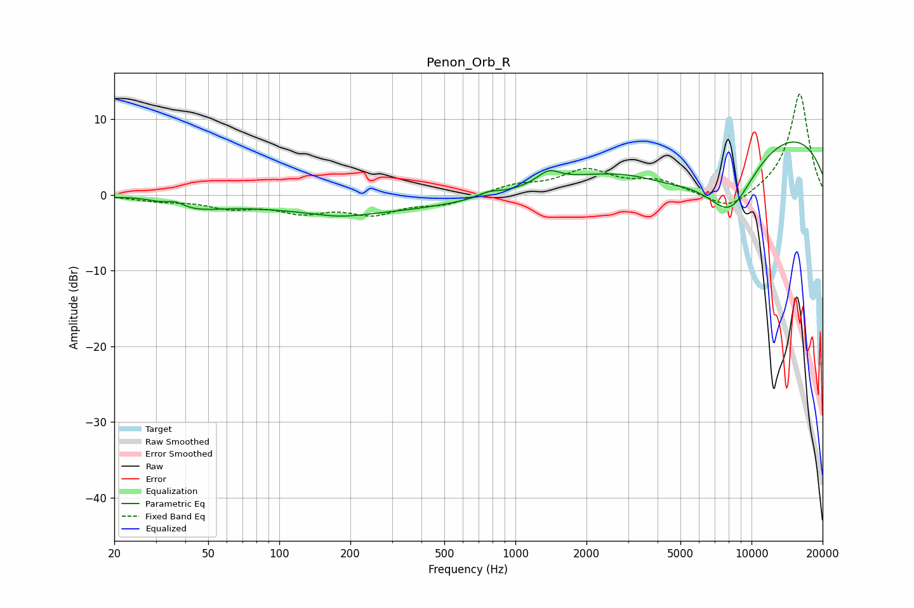

# Penon_Orb_R
See [usage instructions](https://github.com/jaakkopasanen/AutoEq#usage) for more options and info.

### Parametric EQs
Apply preamp of -7.1 dB when using parametric equalizer.

|   # | Type    |   Fc (Hz) |    Q |   Gain (dB) |
|-----|---------|-----------|------|-------------|
|   1 | Peaking |        26 | 1.74 |         0.4 |
|   2 | Peaking |        36 | 3.6  |         0.8 |
|   3 | Peaking |        41 | 1.03 |        -1.5 |
|   4 | Peaking |       181 | 1.33 |        -0.6 |
|   5 | Peaking |       222 | 0.33 |        -2.2 |
|   6 | Peaking |       774 | 3.34 |         0.6 |
|   7 | Peaking |      1380 | 2.89 |         1.7 |
|   8 | Peaking |      4524 | 0.8  |        -3.6 |
|   9 | Peaking |      8094 | 1.04 |        -9.9 |
|  10 | Peaking |      9720 | 0.21 |        10   |

### Fixed Band EQs
When using fixed band (also called graphic) equalizer, apply preamp of **-13.4 dB** (if available) and set gains manually with these parameters.

|   # | Type    |   Fc (Hz) |    Q |   Gain (dB) |
|-----|---------|-----------|------|-------------|
|   1 | Peaking |        31 | 1.41 |        -0.6 |
|   2 | Peaking |        62 | 1.41 |        -1.5 |
|   3 | Peaking |       125 | 1.41 |        -1.9 |
|   4 | Peaking |       250 | 1.41 |        -2.2 |
|   5 | Peaking |       500 | 1.41 |        -1.2 |
|   6 | Peaking |      1000 | 1.41 |         1.2 |
|   7 | Peaking |      2000 | 1.41 |         3.1 |
|   8 | Peaking |      4000 | 1.41 |         1.7 |
|   9 | Peaking |      8000 | 1.41 |        -2.3 |
|  10 | Peaking |     16000 | 1.41 |        13.5 |

### Graphs

