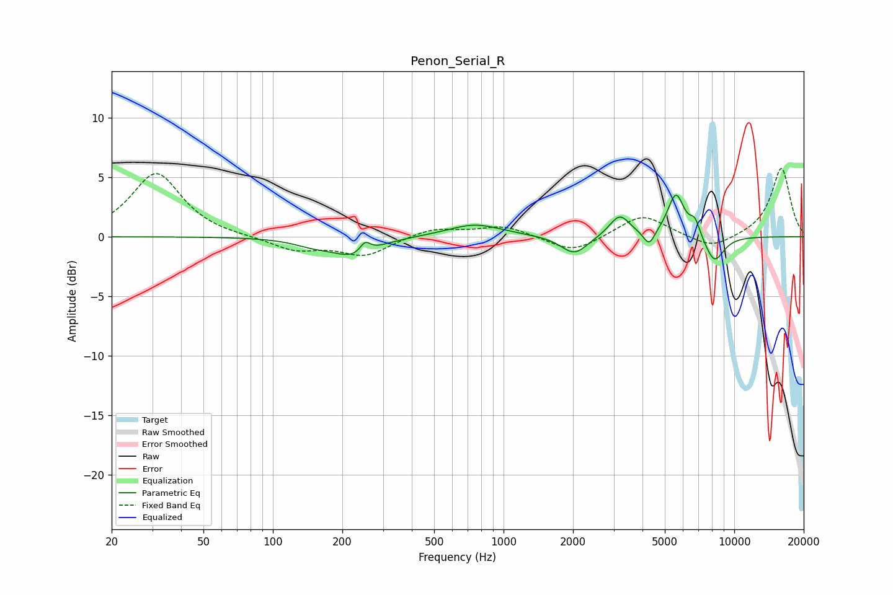

# Penon_Serial_R
See [usage instructions](https://github.com/jaakkopasanen/AutoEq#usage) for more options and info.

### Parametric EQs
Apply preamp of -3.6 dB when using parametric equalizer.

|   # | Type    |   Fc (Hz) |    Q |   Gain (dB) |
|-----|---------|-----------|------|-------------|
|   1 | Peaking |       151 | 1.65 |        -0.5 |
|   2 | Peaking |       227 | 1.57 |        -1.6 |
|   3 | Peaking |       251 | 6    |         1   |
|   4 | Peaking |       750 | 1.21 |         1.1 |
|   5 | Peaking |      2028 | 2.46 |        -1.6 |
|   6 | Peaking |      3186 | 3.17 |         1.8 |
|   7 | Peaking |      4274 | 5.67 |        -1.3 |
|   8 | Peaking |      5588 | 3.82 |         3.6 |
|   9 | Peaking |      6755 | 5.98 |         1.3 |
|  10 | Peaking |      8201 | 3.14 |        -2.3 |

### Fixed Band EQs
When using fixed band (also called graphic) equalizer, apply preamp of **-5.8 dB** (if available) and set gains manually with these parameters.

|   # | Type    |   Fc (Hz) |    Q |   Gain (dB) |
|-----|---------|-----------|------|-------------|
|   1 | Peaking |        31 | 1.41 |         5.4 |
|   2 | Peaking |        62 | 1.41 |        -0   |
|   3 | Peaking |       125 | 1.41 |        -1.1 |
|   4 | Peaking |       250 | 1.41 |        -1.6 |
|   5 | Peaking |       500 | 1.41 |         0.7 |
|   6 | Peaking |      1000 | 1.41 |         0.9 |
|   7 | Peaking |      2000 | 1.41 |        -1.4 |
|   8 | Peaking |      4000 | 1.41 |         1.9 |
|   9 | Peaking |      8000 | 1.41 |        -1.1 |
|  10 | Peaking |     16000 | 1.41 |         5.8 |

### Graphs

