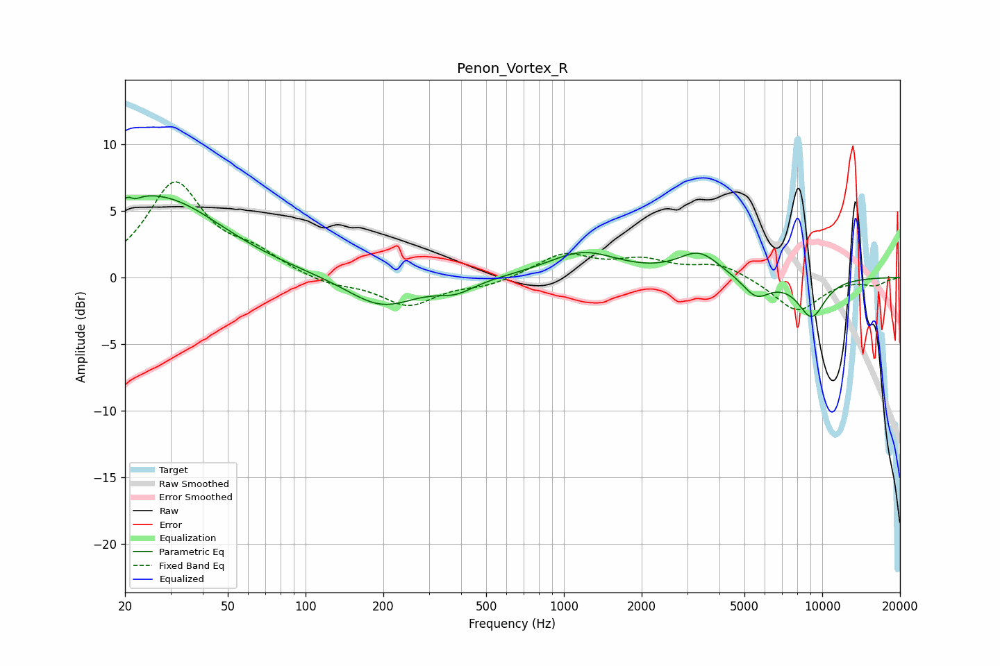

# Penon_Vortex_R
See [usage instructions](https://github.com/jaakkopasanen/AutoEq#usage) for more options and info.

### Parametric EQs
Apply preamp of -6.2 dB when using parametric equalizer.

|   # | Type    |   Fc (Hz) |    Q |   Gain (dB) |
|-----|---------|-----------|------|-------------|
|   1 | Peaking |        20 | 1.35 |         1.5 |
|   2 | Peaking |        21 | 5.88 |         3.3 |
|   3 | Peaking |        21 | 5.86 |        -3.2 |
|   4 | Peaking |        29 | 0.62 |         5.3 |
|   5 | Peaking |       197 | 1.06 |        -2.3 |
|   6 | Peaking |       382 | 1.92 |        -0.9 |
|   7 | Peaking |      1185 | 1.04 |         1.9 |
|   8 | Peaking |      3336 | 1.76 |         1.8 |
|   9 | Peaking |      5545 | 2.58 |        -1.5 |
|  10 | Peaking |      9100 | 2.35 |        -2.9 |

### Fixed Band EQs
When using fixed band (also called graphic) equalizer, apply preamp of **-7.3 dB** (if available) and set gains manually with these parameters.

|   # | Type    |   Fc (Hz) |    Q |   Gain (dB) |
|-----|---------|-----------|------|-------------|
|   1 | Peaking |        31 | 1.41 |         6.9 |
|   2 | Peaking |        62 | 1.41 |         1.5 |
|   3 | Peaking |       125 | 1.41 |        -0.6 |
|   4 | Peaking |       250 | 1.41 |        -2.1 |
|   5 | Peaking |       500 | 1.41 |        -0.6 |
|   6 | Peaking |      1000 | 1.41 |         1.7 |
|   7 | Peaking |      2000 | 1.41 |         1.1 |
|   8 | Peaking |      4000 | 1.41 |         1   |
|   9 | Peaking |      8000 | 1.41 |        -2.6 |
|  10 | Peaking |     16000 | 1.41 |        -0.5 |

### Graphs

