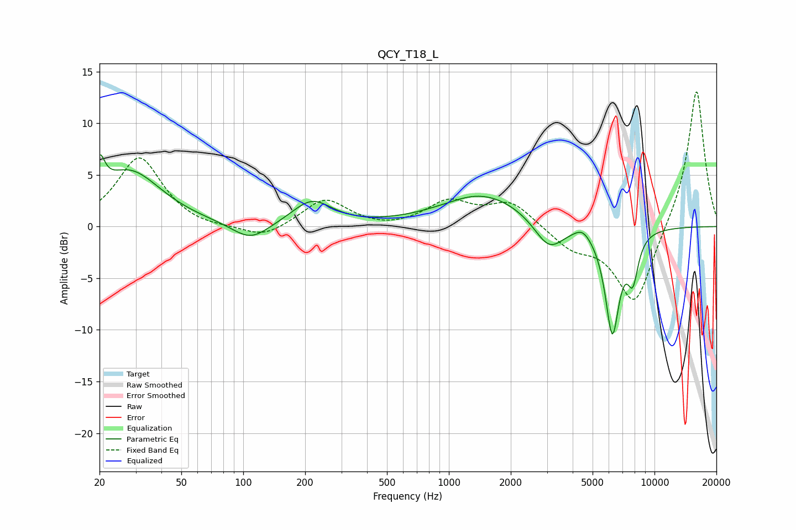

# QCY_T18_L
See [usage instructions](https://github.com/jaakkopasanen/AutoEq#usage) for more options and info.

### Parametric EQs
Apply preamp of -7.0 dB when using parametric equalizer.

|   # | Type    |   Fc (Hz) |    Q |   Gain (dB) |
|-----|---------|-----------|------|-------------|
|   1 | Peaking |        20 | 5.75 |         3.2 |
|   2 | Peaking |        28 | 0.91 |         5.3 |
|   3 | Peaking |       109 | 1.57 |        -1.8 |
|   4 | Peaking |       216 | 1.47 |         2.4 |
|   5 | Peaking |      1298 | 2.55 |         0.1 |
|   6 | Peaking |      1492 | 0.68 |         3.2 |
|   7 | Peaking |      3071 | 1.94 |        -2.9 |
|   8 | Peaking |      4473 | 3.5  |         0.9 |
|   9 | Peaking |      6236 | 3.86 |       -10.2 |
|  10 | Peaking |      7846 | 4.99 |        -4   |

### Fixed Band EQs
When using fixed band (also called graphic) equalizer, apply preamp of **-13.2 dB** (if available) and set gains manually with these parameters.

|   # | Type    |   Fc (Hz) |    Q |   Gain (dB) |
|-----|---------|-----------|------|-------------|
|   1 | Peaking |        31 | 1.41 |         6.7 |
|   2 | Peaking |        62 | 1.41 |        -0.3 |
|   3 | Peaking |       125 | 1.41 |        -1.2 |
|   4 | Peaking |       250 | 1.41 |         2.7 |
|   5 | Peaking |       500 | 1.41 |        -0.3 |
|   6 | Peaking |      1000 | 1.41 |         2.3 |
|   7 | Peaking |      2000 | 1.41 |         2.4 |
|   8 | Peaking |      4000 | 1.41 |        -1.9 |
|   9 | Peaking |      8000 | 1.41 |        -7.7 |
|  10 | Peaking |     16000 | 1.41 |        13.6 |

### Graphs

