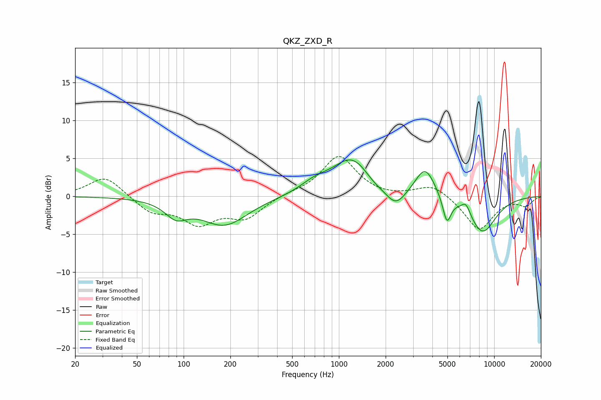

# QKZ_ZXD_R
See [usage instructions](https://github.com/jaakkopasanen/AutoEq#usage) for more options and info.

### Parametric EQs
Apply preamp of -4.9 dB when using parametric equalizer.

|   # | Type    |   Fc (Hz) |    Q |   Gain (dB) |
|-----|---------|-----------|------|-------------|
|   1 | Peaking |        89 | 2.02 |        -2   |
|   2 | Peaking |       183 | 0.95 |        -3.7 |
|   3 | Peaking |       698 | 1.52 |         1.2 |
|   4 | Peaking |      1225 | 1.1  |         5.1 |
|   5 | Peaking |      1682 | 1.87 |        -0.9 |
|   6 | Peaking |      2321 | 2.21 |        -2.4 |
|   7 | Peaking |      3592 | 2.22 |         3.9 |
|   8 | Peaking |      4960 | 5.23 |        -3.4 |
|   9 | Peaking |      6583 | 4.7  |         1.5 |
|  10 | Peaking |      8401 | 1.45 |        -4.8 |

### Fixed Band EQs
When using fixed band (also called graphic) equalizer, apply preamp of **-5.4 dB** (if available) and set gains manually with these parameters.

|   # | Type    |   Fc (Hz) |    Q |   Gain (dB) |
|-----|---------|-----------|------|-------------|
|   1 | Peaking |        31 | 1.41 |         2.8 |
|   2 | Peaking |        62 | 1.41 |        -2   |
|   3 | Peaking |       125 | 1.41 |        -3.3 |
|   4 | Peaking |       250 | 1.41 |        -2.6 |
|   5 | Peaking |       500 | 1.41 |         0.3 |
|   6 | Peaking |      1000 | 1.41 |         5.3 |
|   7 | Peaking |      2000 | 1.41 |        -0.2 |
|   8 | Peaking |      4000 | 1.41 |         1.6 |
|   9 | Peaking |      8000 | 1.41 |        -4.4 |
|  10 | Peaking |     16000 | 1.41 |        -1.2 |

### Graphs

