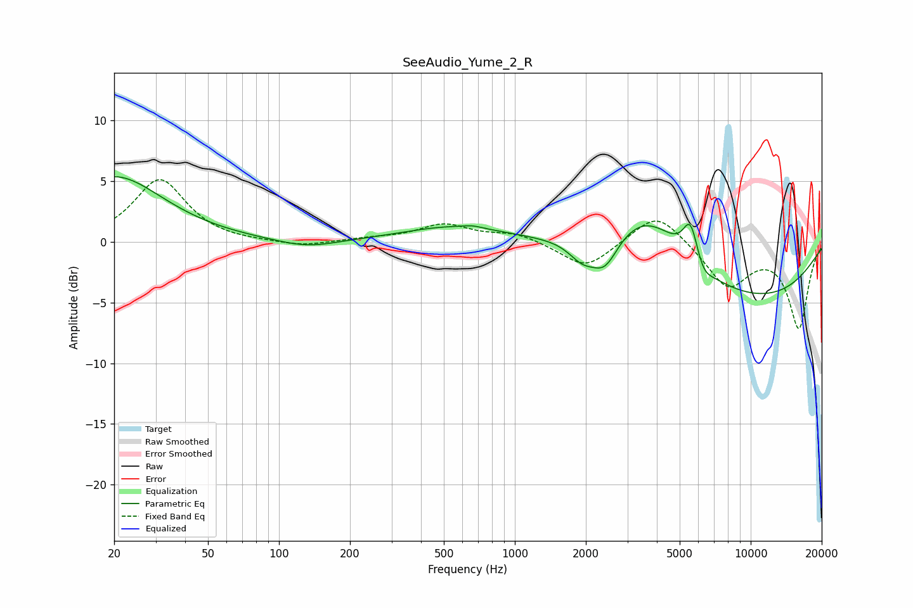

# SeeAudio_Yume_2_R
See [usage instructions](https://github.com/jaakkopasanen/AutoEq#usage) for more options and info.

### Parametric EQs
Apply preamp of -5.5 dB when using parametric equalizer.

|   # | Type    |   Fc (Hz) |    Q |   Gain (dB) |
|-----|---------|-----------|------|-------------|
|   1 | Peaking |        20 | 0.69 |         5.4 |
|   2 | Peaking |       131 | 1.12 |        -0.7 |
|   3 | Peaking |       557 | 0.65 |         1.2 |
|   4 | Peaking |       662 | 3.88 |         0.2 |
|   5 | Peaking |      1929 | 2.46 |        -1.5 |
|   6 | Peaking |      2407 | 2.44 |        -2.6 |
|   7 | Peaking |      3644 | 0.91 |         4.1 |
|   8 | Peaking |      5558 | 4.33 |         3.2 |
|   9 | Peaking |      6286 | 3.89 |        -1   |
|  10 | Peaking |      9824 | 0.33 |        -4.7 |

### Fixed Band EQs
When using fixed band (also called graphic) equalizer, apply preamp of **-5.2 dB** (if available) and set gains manually with these parameters.

|   # | Type    |   Fc (Hz) |    Q |   Gain (dB) |
|-----|---------|-----------|------|-------------|
|   1 | Peaking |        31 | 1.41 |         5.1 |
|   2 | Peaking |        62 | 1.41 |        -0.1 |
|   3 | Peaking |       125 | 1.41 |        -0.4 |
|   4 | Peaking |       250 | 1.41 |         0.2 |
|   5 | Peaking |       500 | 1.41 |         1.4 |
|   6 | Peaking |      1000 | 1.41 |         0.7 |
|   7 | Peaking |      2000 | 1.41 |        -2.3 |
|   8 | Peaking |      4000 | 1.41 |         2.7 |
|   9 | Peaking |      8000 | 1.41 |        -3.6 |
|  10 | Peaking |     16000 | 1.41 |        -7   |

### Graphs

