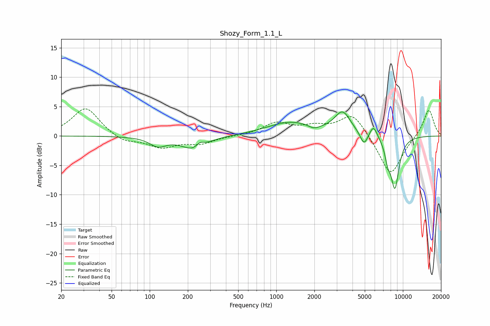

# Shozy_Form_1.1_L
See [usage instructions](https://github.com/jaakkopasanen/AutoEq#usage) for more options and info.

### Parametric EQs
Apply preamp of -4.2 dB when using parametric equalizer.

|   # | Type    |   Fc (Hz) |    Q |   Gain (dB) |
|-----|---------|-----------|------|-------------|
|   1 | Peaking |       116 | 2.15 |        -1.5 |
|   2 | Peaking |       224 | 1.49 |        -2.3 |
|   3 | Peaking |       249 | 4.43 |         0.9 |
|   4 | Peaking |      1294 | 0.77 |         2.3 |
|   5 | Peaking |      1985 | 3.29 |        -0.6 |
|   6 | Peaking |      3338 | 2.21 |         3.7 |
|   7 | Peaking |      4931 | 4.62 |        -2.2 |
|   8 | Peaking |      5856 | 4.56 |         2.1 |
|   9 | Peaking |      7593 | 5.91 |        -2.4 |
|  10 | Peaking |      8647 | 3.77 |        -8.7 |

### Fixed Band EQs
When using fixed band (also called graphic) equalizer, apply preamp of **-4.7 dB** (if available) and set gains manually with these parameters.

|   # | Type    |   Fc (Hz) |    Q |   Gain (dB) |
|-----|---------|-----------|------|-------------|
|   1 | Peaking |        31 | 1.41 |         4.9 |
|   2 | Peaking |        62 | 1.41 |        -1.2 |
|   3 | Peaking |       125 | 1.41 |        -1.9 |
|   4 | Peaking |       250 | 1.41 |        -1.2 |
|   5 | Peaking |       500 | 1.41 |        -0   |
|   6 | Peaking |      1000 | 1.41 |         2.1 |
|   7 | Peaking |      2000 | 1.41 |         1.3 |
|   8 | Peaking |      4000 | 1.41 |         3.9 |
|   9 | Peaking |      8000 | 1.41 |        -6.9 |
|  10 | Peaking |     16000 | 1.41 |         4.7 |

### Graphs

