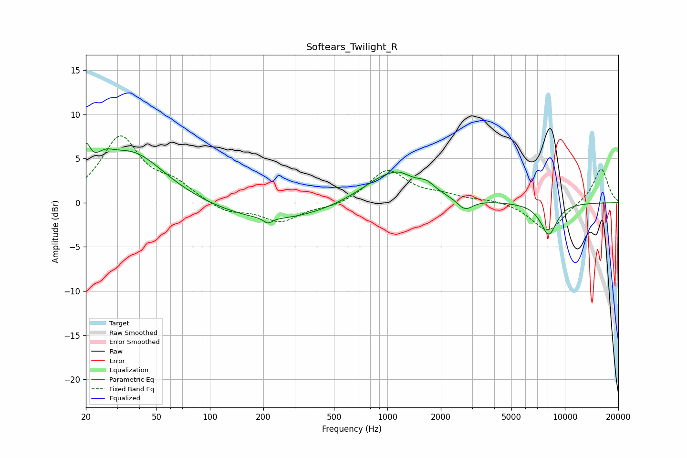

# Softears_Twilight_R
See [usage instructions](https://github.com/jaakkopasanen/AutoEq#usage) for more options and info.

### Parametric EQs
Apply preamp of -6.8 dB when using parametric equalizer.

|   # | Type    |   Fc (Hz) |    Q |   Gain (dB) |
|-----|---------|-----------|------|-------------|
|   1 | Peaking |        20 | 5.67 |         3.3 |
|   2 | Peaking |        25 | 2.6  |         1.5 |
|   3 | Peaking |        36 | 0.76 |         5.6 |
|   4 | Peaking |       212 | 5.98 |        -0.6 |
|   5 | Peaking |       228 | 0.44 |        -2.2 |
|   6 | Peaking |      1042 | 0.88 |         3.5 |
|   7 | Peaking |      1164 | 2.77 |         0.4 |
|   8 | Peaking |      1666 | 3.4  |         0.8 |
|   9 | Peaking |      2731 | 3.18 |        -1.3 |
|  10 | Peaking |      8112 | 2.84 |        -3.6 |

### Fixed Band EQs
When using fixed band (also called graphic) equalizer, apply preamp of **-7.7 dB** (if available) and set gains manually with these parameters.

|   # | Type    |   Fc (Hz) |    Q |   Gain (dB) |
|-----|---------|-----------|------|-------------|
|   1 | Peaking |        31 | 1.41 |         7.3 |
|   2 | Peaking |        62 | 1.41 |         1.8 |
|   3 | Peaking |       125 | 1.41 |        -1.2 |
|   4 | Peaking |       250 | 1.41 |        -2.1 |
|   5 | Peaking |       500 | 1.41 |        -0.5 |
|   6 | Peaking |      1000 | 1.41 |         3.7 |
|   7 | Peaking |      2000 | 1.41 |         0.7 |
|   8 | Peaking |      4000 | 1.41 |         0.3 |
|   9 | Peaking |      8000 | 1.41 |        -3.4 |
|  10 | Peaking |     16000 | 1.41 |         3.9 |

### Graphs

