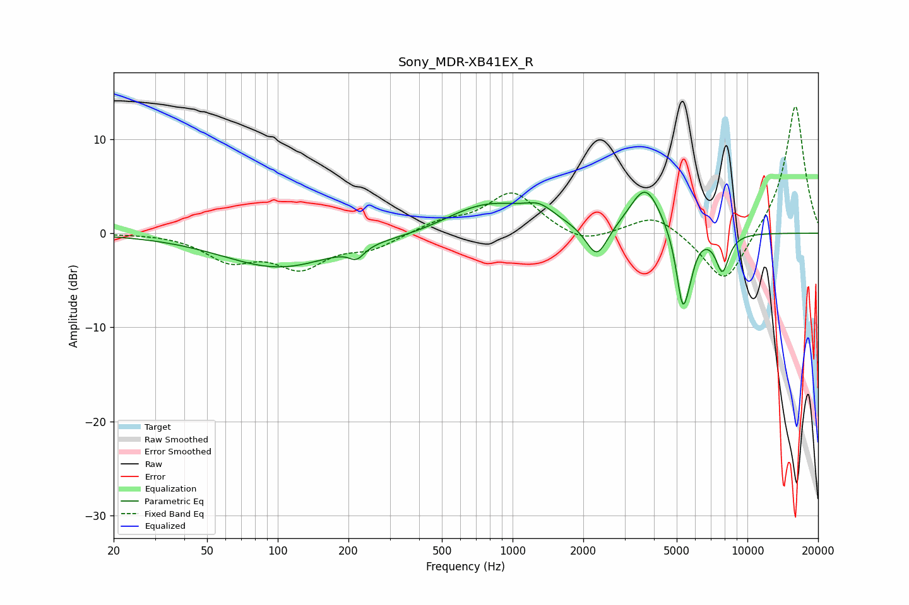

# Sony_MDR-XB41EX_R
See [usage instructions](https://github.com/jaakkopasanen/AutoEq#usage) for more options and info.

### Parametric EQs
Apply preamp of -4.4 dB when using parametric equalizer.

|   # | Type    |   Fc (Hz) |    Q |   Gain (dB) |
|-----|---------|-----------|------|-------------|
|   1 | Peaking |       101 | 0.59 |        -3.6 |
|   2 | Peaking |       217 | 4.4  |        -1.2 |
|   3 | Peaking |       408 | 0.93 |        -0.5 |
|   4 | Peaking |       785 | 0.73 |         3.3 |
|   5 | Peaking |      1305 | 2.29 |         1.3 |
|   6 | Peaking |      2285 | 3.03 |        -3.6 |
|   7 | Peaking |      3682 | 2.1  |         5   |
|   8 | Peaking |      5297 | 5.01 |        -7.9 |
|   9 | Peaking |      5691 | 5.69 |        -1.5 |
|  10 | Peaking |      7825 | 4.65 |        -4   |

### Fixed Band EQs
When using fixed band (also called graphic) equalizer, apply preamp of **-13.6 dB** (if available) and set gains manually with these parameters.

|   # | Type    |   Fc (Hz) |    Q |   Gain (dB) |
|-----|---------|-----------|------|-------------|
|   1 | Peaking |        31 | 1.41 |         0.1 |
|   2 | Peaking |        62 | 1.41 |        -2.6 |
|   3 | Peaking |       125 | 1.41 |        -3.3 |
|   4 | Peaking |       250 | 1.41 |        -1.5 |
|   5 | Peaking |       500 | 1.41 |         1.1 |
|   6 | Peaking |      1000 | 1.41 |         4.3 |
|   7 | Peaking |      2000 | 1.41 |        -1.3 |
|   8 | Peaking |      4000 | 1.41 |         2.1 |
|   9 | Peaking |      8000 | 1.41 |        -5.8 |
|  10 | Peaking |     16000 | 1.41 |        13.8 |

### Graphs

