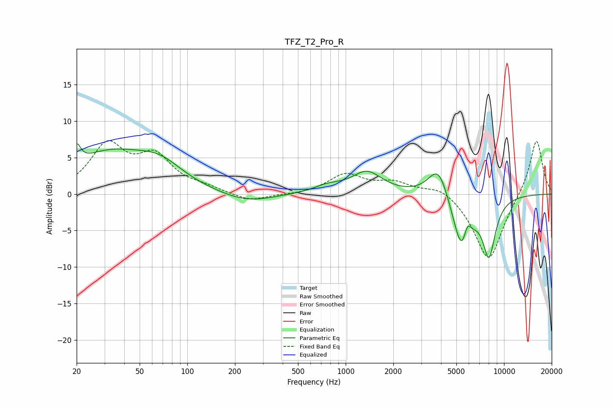

# TFZ_T2_Pro_R
See [usage instructions](https://github.com/jaakkopasanen/AutoEq#usage) for more options and info.

### Parametric EQs
Apply preamp of -7.0 dB when using parametric equalizer.

|   # | Type    |   Fc (Hz) |    Q |   Gain (dB) |
|-----|---------|-----------|------|-------------|
|   1 | Peaking |        20 | 5.79 |         2.6 |
|   2 | Peaking |        32 | 0.58 |         5.3 |
|   3 | Peaking |        67 | 0.97 |         2.7 |
|   4 | Peaking |       238 | 0.87 |        -1.3 |
|   5 | Peaking |       772 | 1.53 |         0.9 |
|   6 | Peaking |      1363 | 1.5  |         2.9 |
|   7 | Peaking |      3862 | 2.18 |         4.6 |
|   8 | Peaking |      5454 | 2.33 |        -8.5 |
|   9 | Peaking |      5856 | 5.69 |         2.9 |
|  10 | Peaking |      8038 | 3.23 |        -7.5 |

### Fixed Band EQs
When using fixed band (also called graphic) equalizer, apply preamp of **-7.4 dB** (if available) and set gains manually with these parameters.

|   # | Type    |   Fc (Hz) |    Q |   Gain (dB) |
|-----|---------|-----------|------|-------------|
|   1 | Peaking |        31 | 1.41 |         6.4 |
|   2 | Peaking |        62 | 1.41 |         4.6 |
|   3 | Peaking |       125 | 1.41 |         0.7 |
|   4 | Peaking |       250 | 1.41 |        -1.1 |
|   5 | Peaking |       500 | 1.41 |        -0.1 |
|   6 | Peaking |      1000 | 1.41 |         2.6 |
|   7 | Peaking |      2000 | 1.41 |         1.5 |
|   8 | Peaking |      4000 | 1.41 |         1.3 |
|   9 | Peaking |      8000 | 1.41 |        -9.3 |
|  10 | Peaking |     16000 | 1.41 |         7.8 |

### Graphs

