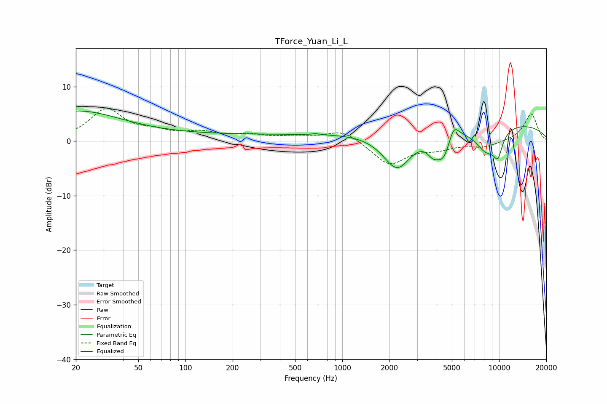

# TForce_Yuan_Li_L
See [usage instructions](https://github.com/jaakkopasanen/AutoEq#usage) for more options and info.

### Parametric EQs
Apply preamp of -5.6 dB when using parametric equalizer.

|   # | Type    |   Fc (Hz) |    Q |   Gain (dB) |
|-----|---------|-----------|------|-------------|
|   1 | Peaking |        20 | 0.48 |         5.3 |
|   2 | Peaking |       257 | 0.18 |         1.1 |
|   3 | Peaking |       679 | 5.95 |         0.2 |
|   4 | Peaking |      2241 | 1.48 |        -7.3 |
|   5 | Peaking |      3772 | 3.78 |        -2.1 |
|   6 | Peaking |      4419 | 2.82 |        -4.8 |
|   7 | Peaking |      5129 | 4.22 |         3   |
|   8 | Peaking |      7794 | 0.18 |         3.7 |
|   9 | Peaking |      8291 | 1.77 |        -4.6 |
|  10 | Peaking |      9828 | 4.15 |        -3.8 |

### Fixed Band EQs
When using fixed band (also called graphic) equalizer, apply preamp of **-6.1 dB** (if available) and set gains manually with these parameters.

|   # | Type    |   Fc (Hz) |    Q |   Gain (dB) |
|-----|---------|-----------|------|-------------|
|   1 | Peaking |        31 | 1.41 |         5.7 |
|   2 | Peaking |        62 | 1.41 |         1.3 |
|   3 | Peaking |       125 | 1.41 |         1.3 |
|   4 | Peaking |       250 | 1.41 |         1   |
|   5 | Peaking |       500 | 1.41 |         0.7 |
|   6 | Peaking |      1000 | 1.41 |         2.1 |
|   7 | Peaking |      2000 | 1.41 |        -4.3 |
|   8 | Peaking |      4000 | 1.41 |        -1.2 |
|   9 | Peaking |      8000 | 1.41 |        -1.1 |
|  10 | Peaking |     16000 | 1.41 |         5.1 |

### Graphs

