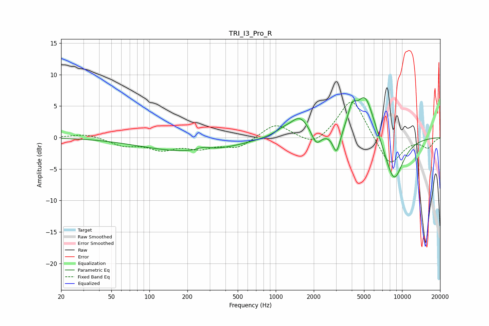

# TRI_I3_Pro_R
See [usage instructions](https://github.com/jaakkopasanen/AutoEq#usage) for more options and info.

### Parametric EQs
Apply preamp of -6.4 dB when using parametric equalizer.

|   # | Type    |   Fc (Hz) |    Q |   Gain (dB) |
|-----|---------|-----------|------|-------------|
|   1 | Peaking |       213 | 0.37 |        -2.2 |
|   2 | Peaking |       270 | 2.74 |         0.5 |
|   3 | Peaking |       828 | 0.83 |         0.3 |
|   4 | Peaking |      1131 | 2.23 |         0.7 |
|   5 | Peaking |      1556 | 1.87 |         3.2 |
|   6 | Peaking |      2094 | 3.72 |        -2.2 |
|   7 | Peaking |      3028 | 4.79 |        -3.5 |
|   8 | Peaking |      4016 | 4.35 |         2.8 |
|   9 | Peaking |      5107 | 1.86 |         7.2 |
|  10 | Peaking |      8606 | 1.69 |        -7.4 |

### Fixed Band EQs
When using fixed band (also called graphic) equalizer, apply preamp of **-5.7 dB** (if available) and set gains manually with these parameters.

|   # | Type    |   Fc (Hz) |    Q |   Gain (dB) |
|-----|---------|-----------|------|-------------|
|   1 | Peaking |        31 | 1.41 |         0.6 |
|   2 | Peaking |        62 | 1.41 |        -1.2 |
|   3 | Peaking |       125 | 1.41 |        -1.7 |
|   4 | Peaking |       250 | 1.41 |        -1.4 |
|   5 | Peaking |       500 | 1.41 |        -1.6 |
|   6 | Peaking |      1000 | 1.41 |         2.3 |
|   7 | Peaking |      2000 | 1.41 |        -1.6 |
|   8 | Peaking |      4000 | 1.41 |         6.5 |
|   9 | Peaking |      8000 | 1.41 |        -4.7 |
|  10 | Peaking |     16000 | 1.41 |        -1.5 |

### Graphs

