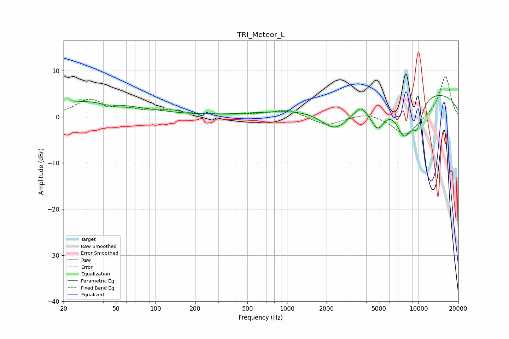

# TRI_Meteor_L
See [usage instructions](https://github.com/jaakkopasanen/AutoEq#usage) for more options and info.

### Parametric EQs
Apply preamp of -4.7 dB when using parametric equalizer.

|   # | Type    |   Fc (Hz) |    Q |   Gain (dB) |
|-----|---------|-----------|------|-------------|
|   1 | Peaking |        20 | 0.24 |         3.5 |
|   2 | Peaking |        44 | 5.39 |        -0.8 |
|   3 | Peaking |      1598 | 0.29 |         1.1 |
|   4 | Peaking |      2342 | 1.17 |        -6.3 |
|   5 | Peaking |      3625 | 4.29 |         1.2 |
|   6 | Peaking |      4900 | 2.43 |        -5.8 |
|   7 | Peaking |      6723 | 4.2  |        -0.1 |
|   8 | Peaking |      7764 | 2.08 |        -8.1 |
|   9 | Peaking |      8918 | 0.2  |         6   |
|  10 | Peaking |      9734 | 2.92 |        -5.3 |

### Fixed Band EQs
When using fixed band (also called graphic) equalizer, apply preamp of **-8.9 dB** (if available) and set gains manually with these parameters.

|   # | Type    |   Fc (Hz) |    Q |   Gain (dB) |
|-----|---------|-----------|------|-------------|
|   1 | Peaking |        31 | 1.41 |         3.6 |
|   2 | Peaking |        62 | 1.41 |         1.2 |
|   3 | Peaking |       125 | 1.41 |         1.2 |
|   4 | Peaking |       250 | 1.41 |         0.4 |
|   5 | Peaking |       500 | 1.41 |         0.4 |
|   6 | Peaking |      1000 | 1.41 |         1.7 |
|   7 | Peaking |      2000 | 1.41 |        -2   |
|   8 | Peaking |      4000 | 1.41 |         1   |
|   9 | Peaking |      8000 | 1.41 |        -4.3 |
|  10 | Peaking |     16000 | 1.41 |         9   |

### Graphs

