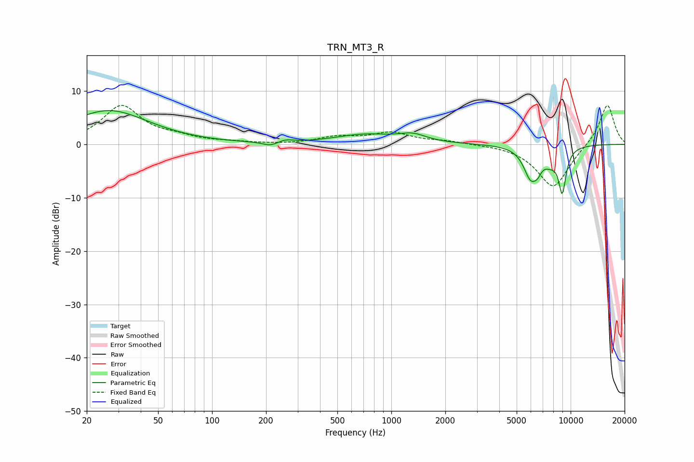

# TRN_MT3_R
See [usage instructions](https://github.com/jaakkopasanen/AutoEq#usage) for more options and info.

### Parametric EQs
Apply preamp of -6.4 dB when using parametric equalizer.

|   # | Type    |   Fc (Hz) |    Q |   Gain (dB) |
|-----|---------|-----------|------|-------------|
|   1 | Peaking |        27 | 0.64 |         6.3 |
|   2 | Peaking |       212 | 3.22 |        -0.8 |
|   3 | Peaking |       256 | 3.27 |         0.6 |
|   4 | Peaking |       710 | 0.85 |         1.7 |
|   5 | Peaking |      1316 | 1.87 |         1.4 |
|   6 | Peaking |      5983 | 3.45 |        -5.5 |
|   7 | Peaking |      6547 | 5.91 |        -1.7 |
|   8 | Peaking |      7715 | 3.04 |        -2.2 |
|   9 | Peaking |      8896 | 6    |         0.2 |
|  10 | Peaking |      8984 | 6    |        -8.1 |

### Fixed Band EQs
When using fixed band (also called graphic) equalizer, apply preamp of **-7.4 dB** (if available) and set gains manually with these parameters.

|   # | Type    |   Fc (Hz) |    Q |   Gain (dB) |
|-----|---------|-----------|------|-------------|
|   1 | Peaking |        31 | 1.41 |         7.1 |
|   2 | Peaking |        62 | 1.41 |         1   |
|   3 | Peaking |       125 | 1.41 |         0.3 |
|   4 | Peaking |       250 | 1.41 |        -0.1 |
|   5 | Peaking |       500 | 1.41 |         1.2 |
|   6 | Peaking |      1000 | 1.41 |         2   |
|   7 | Peaking |      2000 | 1.41 |         0.5 |
|   8 | Peaking |      4000 | 1.41 |         0.1 |
|   9 | Peaking |      8000 | 1.41 |        -8.2 |
|  10 | Peaking |     16000 | 1.41 |         7.7 |

### Graphs

