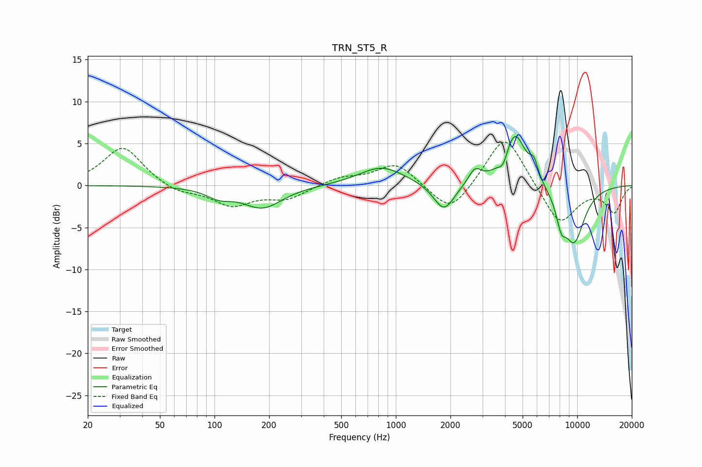

# TRN_ST5_R
See [usage instructions](https://github.com/jaakkopasanen/AutoEq#usage) for more options and info.

### Parametric EQs
Apply preamp of -5.9 dB when using parametric equalizer.

|   # | Type    |   Fc (Hz) |    Q |   Gain (dB) |
|-----|---------|-----------|------|-------------|
|   1 | Peaking |       106 | 2.05 |        -1   |
|   2 | Peaking |       184 | 1.3  |        -2.6 |
|   3 | Peaking |       837 | 1.13 |         2.3 |
|   4 | Peaking |      1844 | 2.46 |        -3.4 |
|   5 | Peaking |      2730 | 3.95 |         1.7 |
|   6 | Peaking |      3908 | 5.99 |        -1.4 |
|   7 | Peaking |      4533 | 2.28 |         6.4 |
|   8 | Peaking |      5771 | 5.83 |         1.9 |
|   9 | Peaking |      8158 | 4.86 |        -2.6 |
|  10 | Peaking |      9596 | 2.02 |        -6.7 |

### Fixed Band EQs
When using fixed band (also called graphic) equalizer, apply preamp of **-5.3 dB** (if available) and set gains manually with these parameters.

|   # | Type    |   Fc (Hz) |    Q |   Gain (dB) |
|-----|---------|-----------|------|-------------|
|   1 | Peaking |        31 | 1.41 |         4.7 |
|   2 | Peaking |        62 | 1.41 |        -0.9 |
|   3 | Peaking |       125 | 1.41 |        -2.3 |
|   4 | Peaking |       250 | 1.41 |        -1.5 |
|   5 | Peaking |       500 | 1.41 |         0.9 |
|   6 | Peaking |      1000 | 1.41 |         2.7 |
|   7 | Peaking |      2000 | 1.41 |        -3.6 |
|   8 | Peaking |      4000 | 1.41 |         6.4 |
|   9 | Peaking |      8000 | 1.41 |        -4.8 |
|  10 | Peaking |     16000 | 1.41 |        -3.1 |

### Graphs

