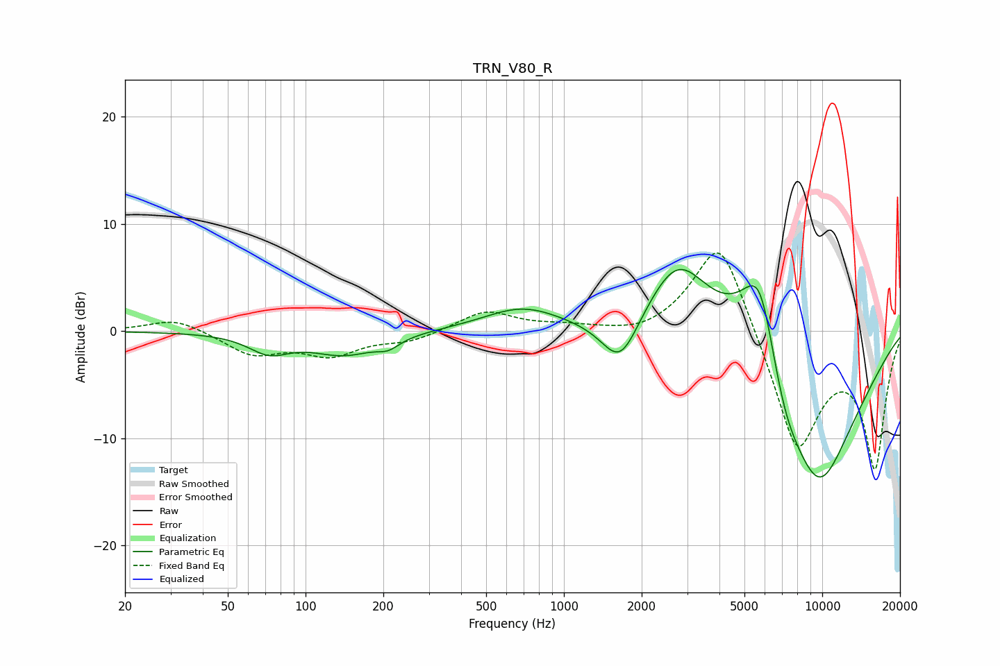

# TRN_V80_R
See [usage instructions](https://github.com/jaakkopasanen/AutoEq#usage) for more options and info.

### Parametric EQs
Apply preamp of -5.9 dB when using parametric equalizer.

|   # | Type    |   Fc (Hz) |    Q |   Gain (dB) |
|-----|---------|-----------|------|-------------|
|   1 | Peaking |        72 | 1.8  |        -1.7 |
|   2 | Peaking |       142 | 1.15 |        -2.6 |
|   3 | Peaking |       142 | 1.42 |         0.5 |
|   4 | Peaking |       209 | 3.29 |        -0.8 |
|   5 | Peaking |       690 | 0.94 |         2.2 |
|   6 | Peaking |      1653 | 1.92 |        -4.8 |
|   7 | Peaking |      2761 | 1.13 |         7.2 |
|   8 | Peaking |      5761 | 1.56 |        12.4 |
|   9 | Peaking |      7008 | 1.71 |        -4.7 |
|  10 | Peaking |      9640 | 0.72 |       -15   |

### Fixed Band EQs
When using fixed band (also called graphic) equalizer, apply preamp of **-7.4 dB** (if available) and set gains manually with these parameters.

|   # | Type    |   Fc (Hz) |    Q |   Gain (dB) |
|-----|---------|-----------|------|-------------|
|   1 | Peaking |        31 | 1.41 |         1.3 |
|   2 | Peaking |        62 | 1.41 |        -2.1 |
|   3 | Peaking |       125 | 1.41 |        -2   |
|   4 | Peaking |       250 | 1.41 |        -0.9 |
|   5 | Peaking |       500 | 1.41 |         1.9 |
|   6 | Peaking |      1000 | 1.41 |         0.4 |
|   7 | Peaking |      2000 | 1.41 |        -0.6 |
|   8 | Peaking |      4000 | 1.41 |         9.4 |
|   9 | Peaking |      8000 | 1.41 |       -11.4 |
|  10 | Peaking |     16000 | 1.41 |       -12.4 |

### Graphs

