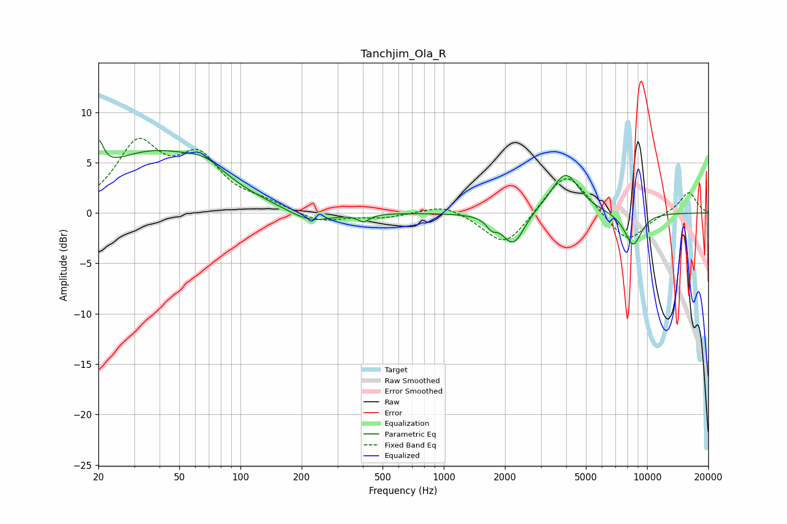

# Tanchjim_Ola_R
See [usage instructions](https://github.com/jaakkopasanen/AutoEq#usage) for more options and info.

### Parametric EQs
Apply preamp of -7.3 dB when using parametric equalizer.

|   # | Type    |   Fc (Hz) |    Q |   Gain (dB) |
|-----|---------|-----------|------|-------------|
|   1 | Peaking |        20 | 5.77 |         3   |
|   2 | Peaking |        37 | 0.49 |         5.8 |
|   3 | Peaking |        67 | 1.5  |         1.4 |
|   4 | Peaking |       219 | 1.3  |        -1.3 |
|   5 | Peaking |       403 | 4.8  |        -0.7 |
|   6 | Peaking |      1715 | 5.89 |        -0.8 |
|   7 | Peaking |      2199 | 2.56 |        -3.4 |
|   8 | Peaking |      2912 | 1.74 |         0.2 |
|   9 | Peaking |      3972 | 2.06 |         4   |
|  10 | Peaking |      8530 | 3.03 |        -3.3 |

### Fixed Band EQs
When using fixed band (also called graphic) equalizer, apply preamp of **-7.5 dB** (if available) and set gains manually with these parameters.

|   # | Type    |   Fc (Hz) |    Q |   Gain (dB) |
|-----|---------|-----------|------|-------------|
|   1 | Peaking |        31 | 1.41 |         6.4 |
|   2 | Peaking |        62 | 1.41 |         4.9 |
|   3 | Peaking |       125 | 1.41 |         0.8 |
|   4 | Peaking |       250 | 1.41 |        -1   |
|   5 | Peaking |       500 | 1.41 |        -0.5 |
|   6 | Peaking |      1000 | 1.41 |         1   |
|   7 | Peaking |      2000 | 1.41 |        -3.5 |
|   8 | Peaking |      4000 | 1.41 |         4.4 |
|   9 | Peaking |      8000 | 1.41 |        -3.1 |
|  10 | Peaking |     16000 | 1.41 |         2.1 |

### Graphs

