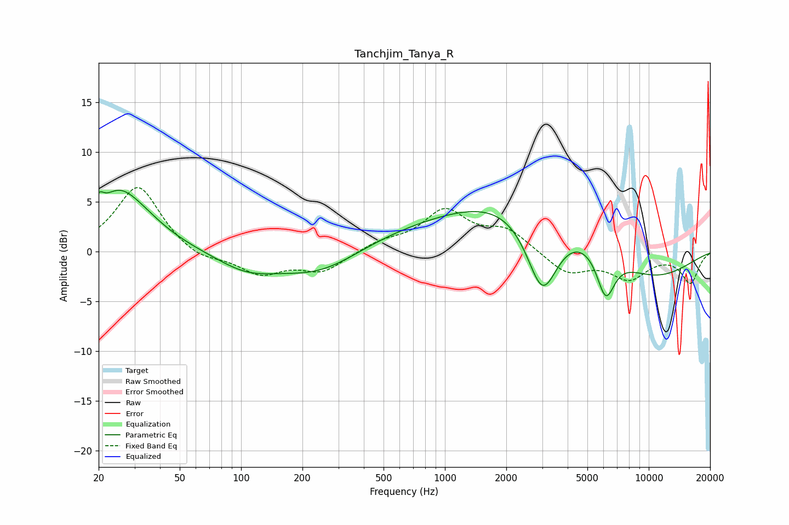

# Tanchjim_Tanya_R
See [usage instructions](https://github.com/jaakkopasanen/AutoEq#usage) for more options and info.

### Parametric EQs
Apply preamp of -6.3 dB when using parametric equalizer.

|   # | Type    |   Fc (Hz) |    Q |   Gain (dB) |
|-----|---------|-----------|------|-------------|
|   1 | Peaking |        20 | 5.85 |         1.7 |
|   2 | Peaking |        25 | 1.9  |         1.7 |
|   3 | Peaking |        28 | 0.94 |         4.6 |
|   4 | Peaking |       106 | 0.96 |        -1.7 |
|   5 | Peaking |       246 | 0.66 |        -3.1 |
|   6 | Peaking |       994 | 0.23 |         2.6 |
|   7 | Peaking |      3010 | 1.69 |        -8.6 |
|   8 | Peaking |      3170 | 0.39 |         4.5 |
|   9 | Peaking |      6149 | 3.04 |        -4.8 |
|  10 | Peaking |      9531 | 0.53 |        -3.7 |

### Fixed Band EQs
When using fixed band (also called graphic) equalizer, apply preamp of **-6.5 dB** (if available) and set gains manually with these parameters.

|   # | Type    |   Fc (Hz) |    Q |   Gain (dB) |
|-----|---------|-----------|------|-------------|
|   1 | Peaking |        31 | 1.41 |         6.7 |
|   2 | Peaking |        62 | 1.41 |        -1   |
|   3 | Peaking |       125 | 1.41 |        -2.2 |
|   4 | Peaking |       250 | 1.41 |        -1.9 |
|   5 | Peaking |       500 | 1.41 |         0.9 |
|   6 | Peaking |      1000 | 1.41 |         4   |
|   7 | Peaking |      2000 | 1.41 |         2.1 |
|   8 | Peaking |      4000 | 1.41 |        -2.2 |
|   9 | Peaking |      8000 | 1.41 |        -2.5 |
|  10 | Peaking |     16000 | 1.41 |        -3.1 |

### Graphs

