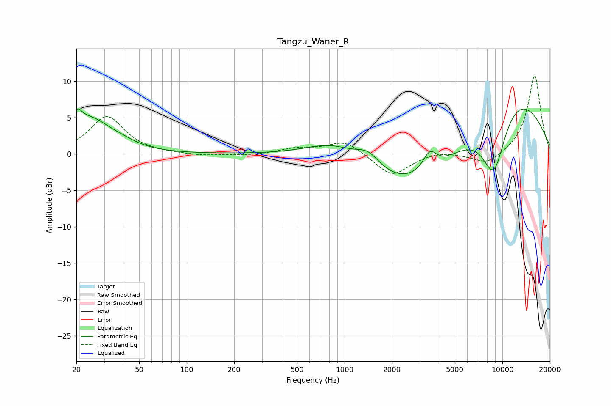

# Tangzu_Waner_R
See [usage instructions](https://github.com/jaakkopasanen/AutoEq#usage) for more options and info.

### Parametric EQs
Apply preamp of -6.3 dB when using parametric equalizer.

|   # | Type    |   Fc (Hz) |    Q |   Gain (dB) |
|-----|---------|-----------|------|-------------|
|   1 | Peaking |        20 | 5.21 |         2.3 |
|   2 | Peaking |        22 | 1.76 |         1.7 |
|   3 | Peaking |        26 | 1.3  |         2.9 |
|   4 | Peaking |        38 | 1.32 |         1   |
|   5 | Peaking |       868 | 0.78 |         3.1 |
|   6 | Peaking |      1414 | 1.76 |         2.3 |
|   7 | Peaking |      2908 | 0.37 |        -7   |
|   8 | Peaking |      3470 | 3.2  |         2.6 |
|   9 | Peaking |      8835 | 1.44 |       -10.8 |
|  10 | Peaking |      9729 | 0.4  |        11.8 |

### Fixed Band EQs
When using fixed band (also called graphic) equalizer, apply preamp of **-10.8 dB** (if available) and set gains manually with these parameters.

|   # | Type    |   Fc (Hz) |    Q |   Gain (dB) |
|-----|---------|-----------|------|-------------|
|   1 | Peaking |        31 | 1.41 |         5.1 |
|   2 | Peaking |        62 | 1.41 |        -0   |
|   3 | Peaking |       125 | 1.41 |        -0.3 |
|   4 | Peaking |       250 | 1.41 |        -0.2 |
|   5 | Peaking |       500 | 1.41 |         0.7 |
|   6 | Peaking |      1000 | 1.41 |         1.8 |
|   7 | Peaking |      2000 | 1.41 |        -3.1 |
|   8 | Peaking |      4000 | 1.41 |         0.4 |
|   9 | Peaking |      8000 | 1.41 |        -1.6 |
|  10 | Peaking |     16000 | 1.41 |        10.9 |

### Graphs

