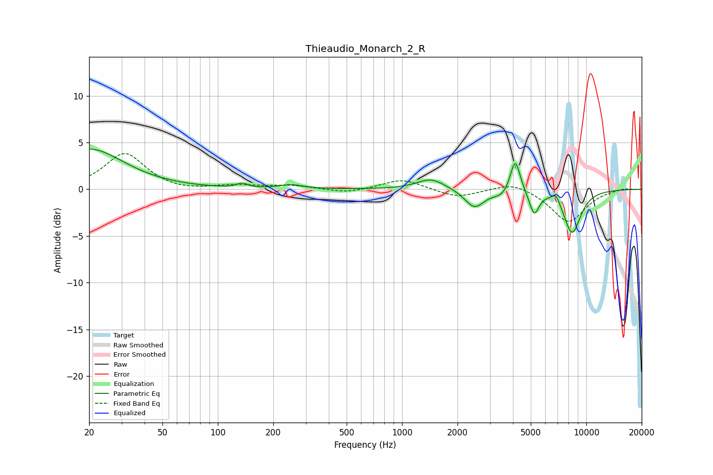

# Thieaudio_Monarch_2_R
See [usage instructions](https://github.com/jaakkopasanen/AutoEq#usage) for more options and info.

### Parametric EQs
Apply preamp of -4.4 dB when using parametric equalizer.

|   # | Type    |   Fc (Hz) |    Q |   Gain (dB) |
|-----|---------|-----------|------|-------------|
|   1 | Peaking |        20 | 0.76 |         4.3 |
|   2 | Peaking |       135 | 5.56 |         0.5 |
|   3 | Peaking |       250 | 2.29 |         0.4 |
|   4 | Peaking |      1436 | 1.88 |         1.2 |
|   5 | Peaking |      2473 | 2.69 |        -2   |
|   6 | Peaking |      3496 | 3.17 |        -0.7 |
|   7 | Peaking |      4115 | 5.24 |         3.7 |
|   8 | Peaking |      5215 | 5.43 |        -2.5 |
|   9 | Peaking |      6852 | 6    |         1   |
|  10 | Peaking |      8386 | 2.76 |        -4.7 |

### Fixed Band EQs
When using fixed band (also called graphic) equalizer, apply preamp of **-3.9 dB** (if available) and set gains manually with these parameters.

|   # | Type    |   Fc (Hz) |    Q |   Gain (dB) |
|-----|---------|-----------|------|-------------|
|   1 | Peaking |        31 | 1.41 |         3.9 |
|   2 | Peaking |        62 | 1.41 |        -0.3 |
|   3 | Peaking |       125 | 1.41 |         0.4 |
|   4 | Peaking |       250 | 1.41 |         0.4 |
|   5 | Peaking |       500 | 1.41 |        -0.4 |
|   6 | Peaking |      1000 | 1.41 |         1.1 |
|   7 | Peaking |      2000 | 1.41 |        -0.9 |
|   8 | Peaking |      4000 | 1.41 |         0.9 |
|   9 | Peaking |      8000 | 1.41 |        -3.5 |
|  10 | Peaking |     16000 | 1.41 |         0.2 |

### Graphs

