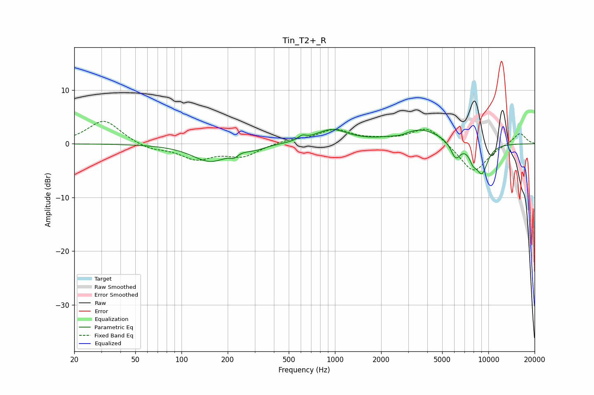

# Tin_T2+_R
See [usage instructions](https://github.com/jaakkopasanen/AutoEq#usage) for more options and info.

### Parametric EQs
Apply preamp of -2.8 dB when using parametric equalizer.

|   # | Type    |   Fc (Hz) |    Q |   Gain (dB) |
|-----|---------|-----------|------|-------------|
|   1 | Peaking |       154 | 1.21 |        -3.3 |
|   2 | Peaking |       220 | 5.99 |        -0.8 |
|   3 | Peaking |       306 | 2.29 |        -0.6 |
|   4 | Peaking |       611 | 5.7  |         0.8 |
|   5 | Peaking |       949 | 1.36 |         2.5 |
|   6 | Peaking |      2689 | 3    |        -0.4 |
|   7 | Peaking |      3618 | 1.01 |         2.8 |
|   8 | Peaking |      6120 | 4.31 |        -3.1 |
|   9 | Peaking |      7937 | 5.21 |        -1.9 |
|  10 | Peaking |      9062 | 3.13 |        -5.4 |

### Fixed Band EQs
When using fixed band (also called graphic) equalizer, apply preamp of **-4.3 dB** (if available) and set gains manually with these parameters.

|   # | Type    |   Fc (Hz) |    Q |   Gain (dB) |
|-----|---------|-----------|------|-------------|
|   1 | Peaking |        31 | 1.41 |         4.5 |
|   2 | Peaking |        62 | 1.41 |        -1.1 |
|   3 | Peaking |       125 | 1.41 |        -2.7 |
|   4 | Peaking |       250 | 1.41 |        -2.2 |
|   5 | Peaking |       500 | 1.41 |         0.7 |
|   6 | Peaking |      1000 | 1.41 |         2.5 |
|   7 | Peaking |      2000 | 1.41 |         0.5 |
|   8 | Peaking |      4000 | 1.41 |         3.3 |
|   9 | Peaking |      8000 | 1.41 |        -5.5 |
|  10 | Peaking |     16000 | 1.41 |         2.1 |

### Graphs

