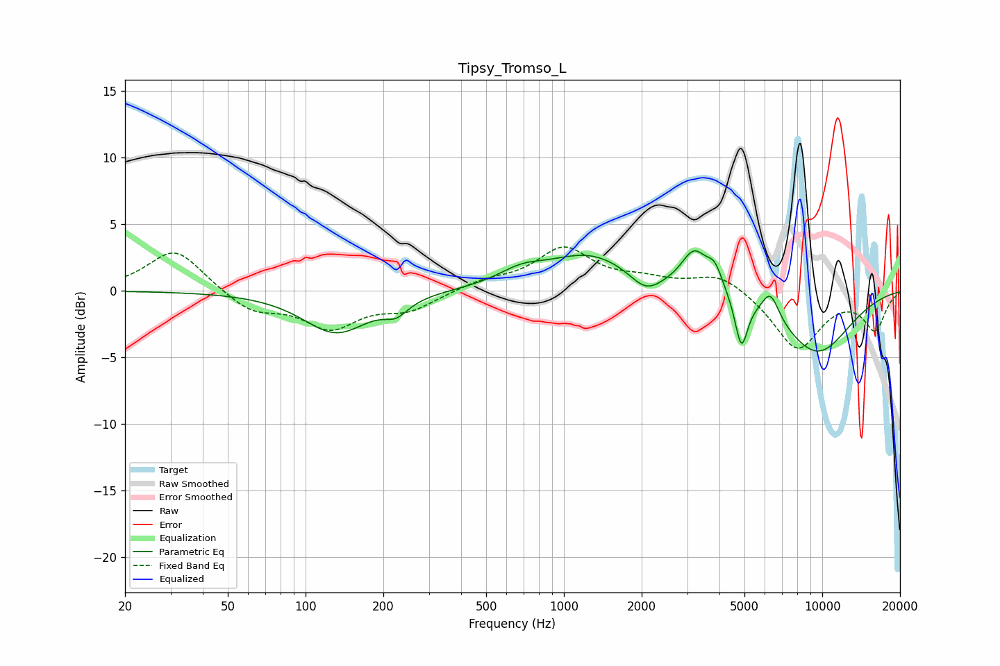

# Tipsy_Tromso_L
See [usage instructions](https://github.com/jaakkopasanen/AutoEq#usage) for more options and info.

### Parametric EQs
Apply preamp of -3.1 dB when using parametric equalizer.

|   # | Type    |   Fc (Hz) |    Q |   Gain (dB) |
|-----|---------|-----------|------|-------------|
|   1 | Peaking |       131 | 1.11 |        -3.1 |
|   2 | Peaking |       224 | 3.06 |        -1   |
|   3 | Peaking |       684 | 1.6  |         0.9 |
|   4 | Peaking |      1265 | 0.82 |         2.7 |
|   5 | Peaking |      2075 | 2.3  |        -1.4 |
|   6 | Peaking |      3194 | 2.79 |         2.8 |
|   7 | Peaking |      3839 | 4.43 |         1.6 |
|   8 | Peaking |      4865 | 5.79 |        -3.7 |
|   9 | Peaking |      6302 | 4.08 |         2   |
|  10 | Peaking |      9516 | 0.88 |        -4.7 |

### Fixed Band EQs
When using fixed band (also called graphic) equalizer, apply preamp of **-3.4 dB** (if available) and set gains manually with these parameters.

|   # | Type    |   Fc (Hz) |    Q |   Gain (dB) |
|-----|---------|-----------|------|-------------|
|   1 | Peaking |        31 | 1.41 |         3.2 |
|   2 | Peaking |        62 | 1.41 |        -1.6 |
|   3 | Peaking |       125 | 1.41 |        -2.6 |
|   4 | Peaking |       250 | 1.41 |        -1.3 |
|   5 | Peaking |       500 | 1.41 |         0.7 |
|   6 | Peaking |      1000 | 1.41 |         3.1 |
|   7 | Peaking |      2000 | 1.41 |         0.7 |
|   8 | Peaking |      4000 | 1.41 |         1.4 |
|   9 | Peaking |      8000 | 1.41 |        -4.4 |
|  10 | Peaking |     16000 | 1.41 |        -2.8 |

### Graphs

