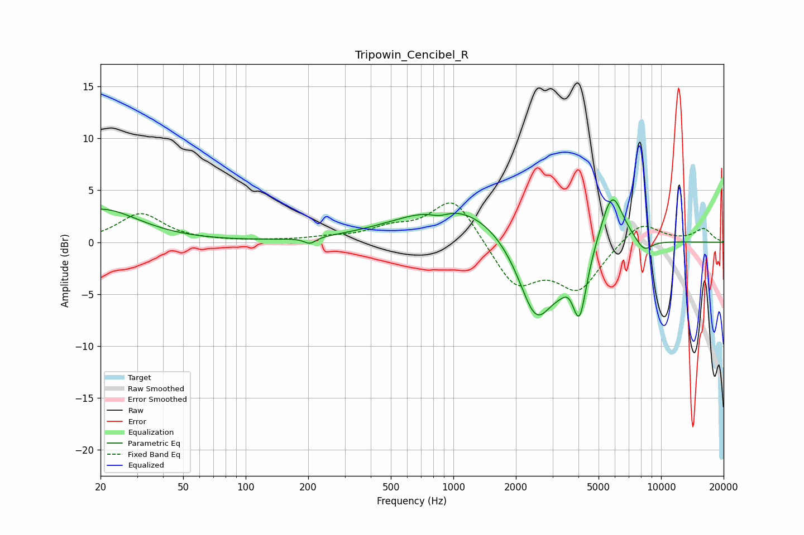

# Tripowin_Cencibel_R
See [usage instructions](https://github.com/jaakkopasanen/AutoEq#usage) for more options and info.

### Parametric EQs
Apply preamp of -4.2 dB when using parametric equalizer.

|   # | Type    |   Fc (Hz) |    Q |   Gain (dB) |
|-----|---------|-----------|------|-------------|
|   1 | Peaking |        20 | 0.79 |         3.2 |
|   2 | Peaking |       204 | 4.85 |        -0.6 |
|   3 | Peaking |       856 | 3.08 |        -0.6 |
|   4 | Peaking |      1042 | 0.53 |         3.8 |
|   5 | Peaking |      2496 | 1.61 |        -8   |
|   6 | Peaking |      3467 | 2.09 |        -2.3 |
|   7 | Peaking |      3581 | 4.18 |         1.1 |
|   8 | Peaking |      4052 | 4.1  |        -5.7 |
|   9 | Peaking |      5801 | 2.48 |         5.3 |
|  10 | Peaking |      8271 | 3.31 |        -1.2 |

### Fixed Band EQs
When using fixed band (also called graphic) equalizer, apply preamp of **-3.9 dB** (if available) and set gains manually with these parameters.

|   # | Type    |   Fc (Hz) |    Q |   Gain (dB) |
|-----|---------|-----------|------|-------------|
|   1 | Peaking |        31 | 1.41 |         2.7 |
|   2 | Peaking |        62 | 1.41 |         0.1 |
|   3 | Peaking |       125 | 1.41 |         0.1 |
|   4 | Peaking |       250 | 1.41 |         0.3 |
|   5 | Peaking |       500 | 1.41 |         1.1 |
|   6 | Peaking |      1000 | 1.41 |         4.4 |
|   7 | Peaking |      2000 | 1.41 |        -4.2 |
|   8 | Peaking |      4000 | 1.41 |        -4.4 |
|   9 | Peaking |      8000 | 1.41 |         2.1 |
|  10 | Peaking |     16000 | 1.41 |         1.3 |

### Graphs

