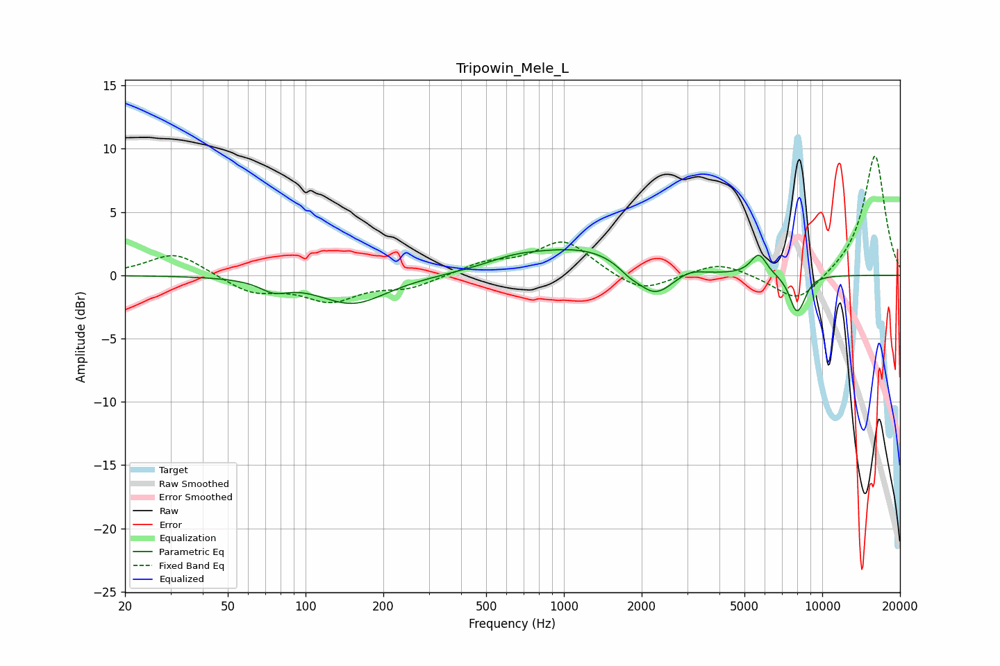

# Tripowin_Mele_L
See [usage instructions](https://github.com/jaakkopasanen/AutoEq#usage) for more options and info.

### Parametric EQs
Apply preamp of -2.1 dB when using parametric equalizer.

|   # | Type    |   Fc (Hz) |    Q |   Gain (dB) |
|-----|---------|-----------|------|-------------|
|   1 | Peaking |        75 | 2.65 |        -0.8 |
|   2 | Peaking |       152 | 1.07 |        -2.3 |
|   3 | Peaking |       644 | 1.21 |         0.7 |
|   4 | Peaking |      1208 | 0.69 |         2.1 |
|   5 | Peaking |      1787 | 3.24 |        -0.6 |
|   6 | Peaking |      2247 | 1.95 |        -2.4 |
|   7 | Peaking |      3072 | 2.75 |         0.4 |
|   8 | Peaking |      5681 | 4.42 |         1.7 |
|   9 | Peaking |      7933 | 4.69 |        -2.6 |
|  10 | Peaking |      8435 | 6    |        -0.6 |

### Fixed Band EQs
When using fixed band (also called graphic) equalizer, apply preamp of **-9.5 dB** (if available) and set gains manually with these parameters.

|   # | Type    |   Fc (Hz) |    Q |   Gain (dB) |
|-----|---------|-----------|------|-------------|
|   1 | Peaking |        31 | 1.41 |         1.9 |
|   2 | Peaking |        62 | 1.41 |        -1.3 |
|   3 | Peaking |       125 | 1.41 |        -1.9 |
|   4 | Peaking |       250 | 1.41 |        -0.9 |
|   5 | Peaking |       500 | 1.41 |         0.9 |
|   6 | Peaking |      1000 | 1.41 |         2.7 |
|   7 | Peaking |      2000 | 1.41 |        -1.5 |
|   8 | Peaking |      4000 | 1.41 |         1.1 |
|   9 | Peaking |      8000 | 1.41 |        -2.3 |
|  10 | Peaking |     16000 | 1.41 |         9.6 |

### Graphs

