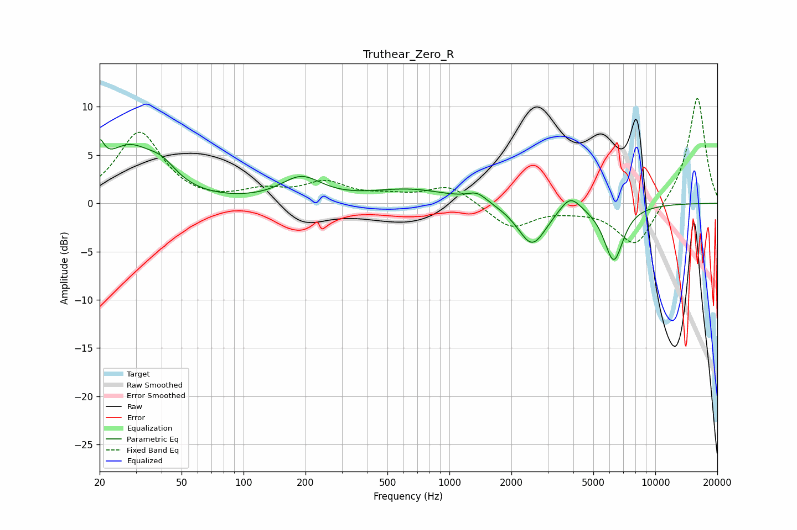

# Truthear_Zero_R
See [usage instructions](https://github.com/jaakkopasanen/AutoEq#usage) for more options and info.

### Parametric EQs
Apply preamp of -6.7 dB when using parametric equalizer.

|   # | Type    |   Fc (Hz) |    Q |   Gain (dB) |
|-----|---------|-----------|------|-------------|
|   1 | Peaking |        20 | 6    |         5.1 |
|   2 | Peaking |        20 | 5.99 |        -2.2 |
|   3 | Peaking |        27 | 1.13 |         5.3 |
|   4 | Peaking |        40 | 1.94 |         1.8 |
|   5 | Peaking |       191 | 1.43 |         2.4 |
|   6 | Peaking |       648 | 0.71 |         1.4 |
|   7 | Peaking |      1363 | 2.93 |         0.9 |
|   8 | Peaking |      2522 | 2.01 |        -4.4 |
|   9 | Peaking |      3859 | 2.83 |         1.7 |
|  10 | Peaking |      6279 | 2.89 |        -5.8 |

### Fixed Band EQs
When using fixed band (also called graphic) equalizer, apply preamp of **-11.0 dB** (if available) and set gains manually with these parameters.

|   # | Type    |   Fc (Hz) |    Q |   Gain (dB) |
|-----|---------|-----------|------|-------------|
|   1 | Peaking |        31 | 1.41 |         7.3 |
|   2 | Peaking |        62 | 1.41 |        -0.1 |
|   3 | Peaking |       125 | 1.41 |         1.1 |
|   4 | Peaking |       250 | 1.41 |         2   |
|   5 | Peaking |       500 | 1.41 |         0.6 |
|   6 | Peaking |      1000 | 1.41 |         1.9 |
|   7 | Peaking |      2000 | 1.41 |        -2.6 |
|   8 | Peaking |      4000 | 1.41 |        -0.4 |
|   9 | Peaking |      8000 | 1.41 |        -4.6 |
|  10 | Peaking |     16000 | 1.41 |        11.2 |

### Graphs

