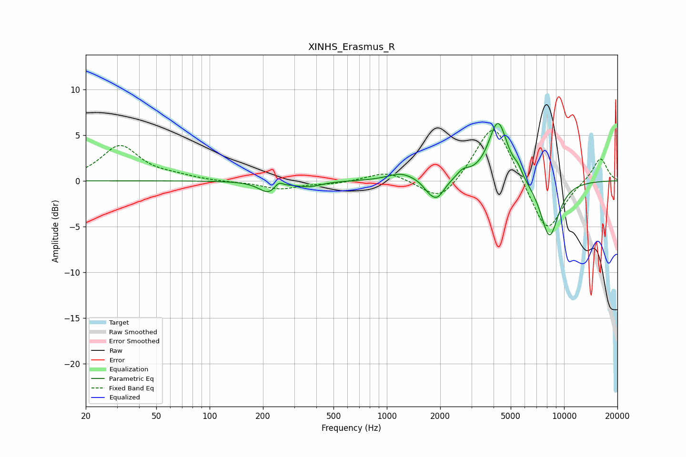

# XINHS_Erasmus_R
See [usage instructions](https://github.com/jaakkopasanen/AutoEq#usage) for more options and info.

### Parametric EQs
Apply preamp of -6.4 dB when using parametric equalizer.

|   # | Type    |   Fc (Hz) |    Q |   Gain (dB) |
|-----|---------|-----------|------|-------------|
|   1 | Peaking |       215 | 2.7  |        -1.3 |
|   2 | Peaking |       245 | 6    |         0.7 |
|   3 | Peaking |       364 | 2.08 |        -0.6 |
|   4 | Peaking |      1205 | 1.91 |         0.9 |
|   5 | Peaking |      1708 | 4.68 |        -0.5 |
|   6 | Peaking |      1919 | 3.34 |        -2.1 |
|   7 | Peaking |      2690 | 4    |         0.8 |
|   8 | Peaking |      4242 | 2.6  |         6.6 |
|   9 | Peaking |      5495 | 6    |         0.7 |
|  10 | Peaking |      8276 | 2.45 |        -6.3 |

### Fixed Band EQs
When using fixed band (also called graphic) equalizer, apply preamp of **-5.6 dB** (if available) and set gains manually with these parameters.

|   # | Type    |   Fc (Hz) |    Q |   Gain (dB) |
|-----|---------|-----------|------|-------------|
|   1 | Peaking |        31 | 1.41 |         3.8 |
|   2 | Peaking |        62 | 1.41 |         0.4 |
|   3 | Peaking |       125 | 1.41 |        -0.1 |
|   4 | Peaking |       250 | 1.41 |        -0.9 |
|   5 | Peaking |       500 | 1.41 |        -0.3 |
|   6 | Peaking |      1000 | 1.41 |         1.1 |
|   7 | Peaking |      2000 | 1.41 |        -2.6 |
|   8 | Peaking |      4000 | 1.41 |         6.8 |
|   9 | Peaking |      8000 | 1.41 |        -6   |
|  10 | Peaking |     16000 | 1.41 |         2.6 |

### Graphs

