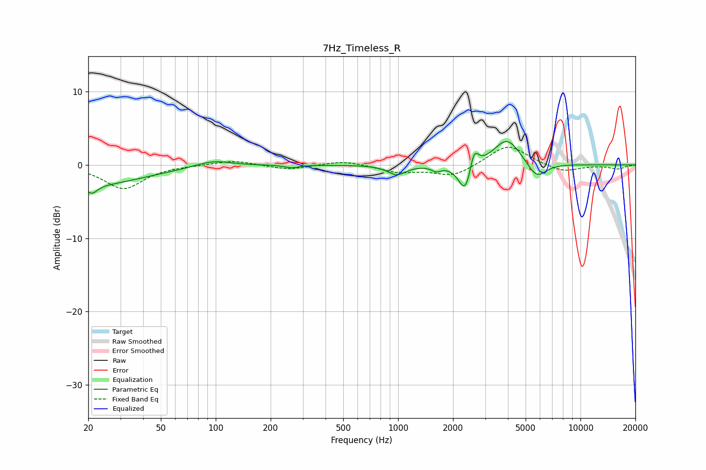

# 7Hz_Timeless_R
See [usage instructions](https://github.com/jaakkopasanen/AutoEq#usage) for more options and info.

### Parametric EQs
Apply preamp of -3.3 dB when using parametric equalizer.

|   # | Type    |   Fc (Hz) |    Q |   Gain (dB) |
|-----|---------|-----------|------|-------------|
|   1 | Peaking |        20 | 0.48 |        -2.7 |
|   2 | Peaking |        21 | 4.93 |        -1.1 |
|   3 | Peaking |        96 | 1.44 |         0.9 |
|   4 | Peaking |       261 | 3.8  |        -0.4 |
|   5 | Peaking |       982 | 2.88 |        -1.3 |
|   6 | Peaking |      1618 | 5.65 |        -0.7 |
|   7 | Peaking |      2344 | 3.81 |        -4.4 |
|   8 | Peaking |      2605 | 5.92 |         3.1 |
|   9 | Peaking |      3961 | 1.89 |         3.7 |
|  10 | Peaking |      5740 | 2.64 |        -2.3 |

### Fixed Band EQs
When using fixed band (also called graphic) equalizer, apply preamp of **-2.5 dB** (if available) and set gains manually with these parameters.

|   # | Type    |   Fc (Hz) |    Q |   Gain (dB) |
|-----|---------|-----------|------|-------------|
|   1 | Peaking |        31 | 1.41 |        -3.2 |
|   2 | Peaking |        62 | 1.41 |        -0   |
|   3 | Peaking |       125 | 1.41 |         0.7 |
|   4 | Peaking |       250 | 1.41 |        -0.7 |
|   5 | Peaking |       500 | 1.41 |         0.6 |
|   6 | Peaking |      1000 | 1.41 |        -0.9 |
|   7 | Peaking |      2000 | 1.41 |        -1.6 |
|   8 | Peaking |      4000 | 1.41 |         2.9 |
|   9 | Peaking |      8000 | 1.41 |        -1   |
|  10 | Peaking |     16000 | 1.41 |        -0.5 |

### Graphs

