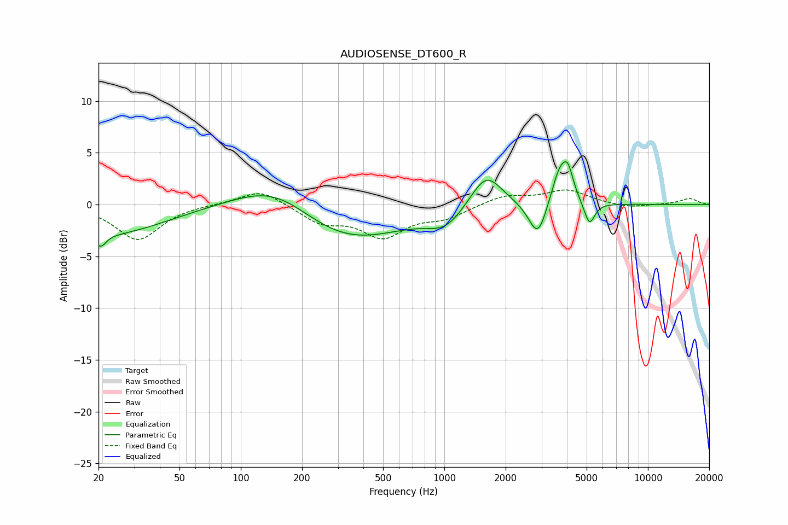

# AUDIOSENSE_DT600_R
See [usage instructions](https://github.com/jaakkopasanen/AutoEq#usage) for more options and info.

### Parametric EQs
Apply preamp of -4.2 dB when using parametric equalizer.

|   # | Type    |   Fc (Hz) |    Q |   Gain (dB) |
|-----|---------|-----------|------|-------------|
|   1 | Peaking |        20 | 5.3  |        -1.3 |
|   2 | Peaking |        23 | 0.53 |        -2.8 |
|   3 | Peaking |       150 | 0.69 |         3.4 |
|   4 | Peaking |       308 | 0.49 |        -4.1 |
|   5 | Peaking |      1015 | 1.56 |        -1.7 |
|   6 | Peaking |      1603 | 1.79 |         3.5 |
|   7 | Peaking |      2882 | 3.13 |        -3.7 |
|   8 | Peaking |      3725 | 3.15 |         3.9 |
|   9 | Peaking |      4061 | 5.98 |         1.8 |
|  10 | Peaking |      5158 | 5.33 |        -2.3 |

### Fixed Band EQs
When using fixed band (also called graphic) equalizer, apply preamp of **-1.5 dB** (if available) and set gains manually with these parameters.

|   # | Type    |   Fc (Hz) |    Q |   Gain (dB) |
|-----|---------|-----------|------|-------------|
|   1 | Peaking |        31 | 1.41 |        -3.4 |
|   2 | Peaking |        62 | 1.41 |         0   |
|   3 | Peaking |       125 | 1.41 |         1.5 |
|   4 | Peaking |       250 | 1.41 |        -1.6 |
|   5 | Peaking |       500 | 1.41 |        -2.9 |
|   6 | Peaking |      1000 | 1.41 |        -1.1 |
|   7 | Peaking |      2000 | 1.41 |         0.9 |
|   8 | Peaking |      4000 | 1.41 |         1.4 |
|   9 | Peaking |      8000 | 1.41 |        -0.4 |
|  10 | Peaking |     16000 | 1.41 |         0.6 |

### Graphs

