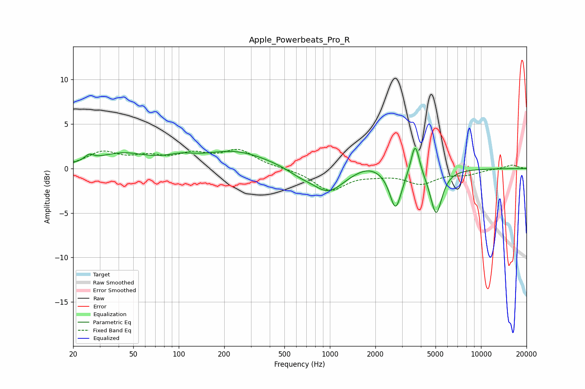

# Apple_Powerbeats_Pro_R
See [usage instructions](https://github.com/jaakkopasanen/AutoEq#usage) for more options and info.

### Parametric EQs
Apply preamp of -2.4 dB when using parametric equalizer.

|   # | Type    |   Fc (Hz) |    Q |   Gain (dB) |
|-----|---------|-----------|------|-------------|
|   1 | Peaking |        25 | 4.9  |         0.7 |
|   2 | Peaking |        42 | 0.84 |         1.5 |
|   3 | Peaking |       103 | 1.59 |         0.6 |
|   4 | Peaking |       237 | 0.65 |         1.9 |
|   5 | Peaking |       636 | 1.64 |        -0.6 |
|   6 | Peaking |       976 | 1.35 |        -2.6 |
|   7 | Peaking |      1787 | 1.5  |         0.7 |
|   8 | Peaking |      2721 | 3.67 |        -4.5 |
|   9 | Peaking |      3669 | 5.16 |         3.7 |
|  10 | Peaking |      5046 | 3.64 |        -5.1 |

### Fixed Band EQs
When using fixed band (also called graphic) equalizer, apply preamp of **-2.2 dB** (if available) and set gains manually with these parameters.

|   # | Type    |   Fc (Hz) |    Q |   Gain (dB) |
|-----|---------|-----------|------|-------------|
|   1 | Peaking |        31 | 1.41 |         1.7 |
|   2 | Peaking |        62 | 1.41 |         1.1 |
|   3 | Peaking |       125 | 1.41 |         1.4 |
|   4 | Peaking |       250 | 1.41 |         1.9 |
|   5 | Peaking |       500 | 1.41 |         0   |
|   6 | Peaking |      1000 | 1.41 |        -2.4 |
|   7 | Peaking |      2000 | 1.41 |        -0.4 |
|   8 | Peaking |      4000 | 1.41 |        -1.6 |
|   9 | Peaking |      8000 | 1.41 |        -0.6 |
|  10 | Peaking |     16000 | 1.41 |         0.4 |

### Graphs

