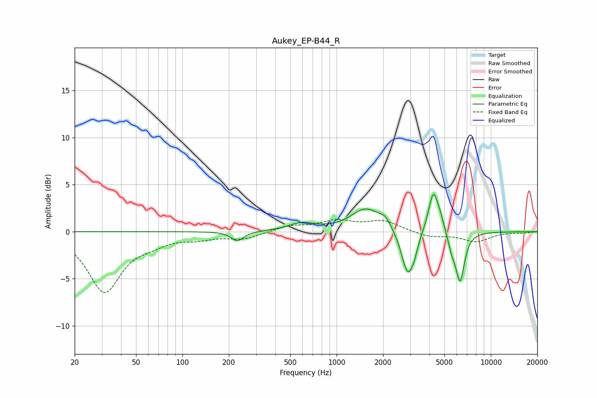

# Aukey_EP-B44_R
See [usage instructions](https://github.com/jaakkopasanen/AutoEq#usage) for more options and info.

### Parametric EQs
Apply preamp of -4.1 dB when using parametric equalizer.

|   # | Type    |   Fc (Hz) |    Q |   Gain (dB) |
|-----|---------|-----------|------|-------------|
|   1 | Peaking |       227 | 3.49 |        -1   |
|   2 | Peaking |       593 | 1.69 |         0.8 |
|   3 | Peaking |      1550 | 1.47 |         2.4 |
|   4 | Peaking |      2061 | 3.87 |         0.9 |
|   5 | Peaking |      2884 | 3.55 |        -4.7 |
|   6 | Peaking |      3182 | 6    |        -1   |
|   7 | Peaking |      4236 | 4.46 |         4.4 |
|   8 | Peaking |      4724 | 5.95 |         0.9 |
|   9 | Peaking |      5575 | 6    |        -1.4 |
|  10 | Peaking |      6315 | 4.81 |        -5.2 |

### Fixed Band EQs
When using fixed band (also called graphic) equalizer, apply preamp of **-1.4 dB** (if available) and set gains manually with these parameters.

|   # | Type    |   Fc (Hz) |    Q |   Gain (dB) |
|-----|---------|-----------|------|-------------|
|   1 | Peaking |        31 | 1.41 |        -6.3 |
|   2 | Peaking |        62 | 1.41 |        -0.8 |
|   3 | Peaking |       125 | 1.41 |        -0.6 |
|   4 | Peaking |       250 | 1.41 |        -0.7 |
|   5 | Peaking |       500 | 1.41 |         0.6 |
|   6 | Peaking |      1000 | 1.41 |         1.1 |
|   7 | Peaking |      2000 | 1.41 |         1.1 |
|   8 | Peaking |      4000 | 1.41 |        -0.5 |
|   9 | Peaking |      8000 | 1.41 |        -1   |
|  10 | Peaking |     16000 | 1.41 |        -0.1 |

### Graphs

