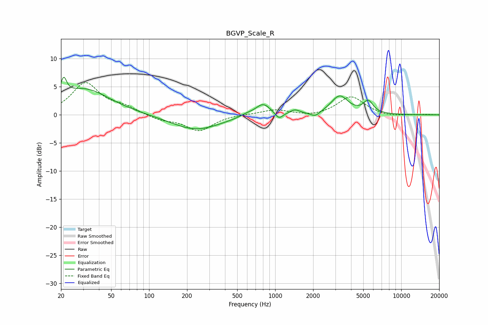

# BGVP_Scale_R
See [usage instructions](https://github.com/jaakkopasanen/AutoEq#usage) for more options and info.

### Parametric EQs
Apply preamp of -6.8 dB when using parametric equalizer.

|   # | Type    |   Fc (Hz) |    Q |   Gain (dB) |
|-----|---------|-----------|------|-------------|
|   1 | Peaking |        21 | 6    |         3.2 |
|   2 | Peaking |        30 | 0.7  |         4.6 |
|   3 | Peaking |       235 | 0.73 |        -2.7 |
|   4 | Peaking |       589 | 2.61 |         0.4 |
|   5 | Peaking |       802 | 2.37 |         2.2 |
|   6 | Peaking |      1071 | 4.59 |        -1.2 |
|   7 | Peaking |      1434 | 3.69 |         0.8 |
|   8 | Peaking |      2079 | 3.86 |        -0.8 |
|   9 | Peaking |      3246 | 2.09 |         3.3 |
|  10 | Peaking |      5468 | 3.59 |         2.1 |

### Fixed Band EQs
When using fixed band (also called graphic) equalizer, apply preamp of **-5.8 dB** (if available) and set gains manually with these parameters.

|   # | Type    |   Fc (Hz) |    Q |   Gain (dB) |
|-----|---------|-----------|------|-------------|
|   1 | Peaking |        31 | 1.41 |         5.6 |
|   2 | Peaking |        62 | 1.41 |         1.2 |
|   3 | Peaking |       125 | 1.41 |        -0.9 |
|   4 | Peaking |       250 | 1.41 |        -2.8 |
|   5 | Peaking |       500 | 1.41 |         0.1 |
|   6 | Peaking |      1000 | 1.41 |         0.9 |
|   7 | Peaking |      2000 | 1.41 |        -0.4 |
|   8 | Peaking |      4000 | 1.41 |         3.3 |
|   9 | Peaking |      8000 | 1.41 |        -0.3 |
|  10 | Peaking |     16000 | 1.41 |         0.1 |

### Graphs

