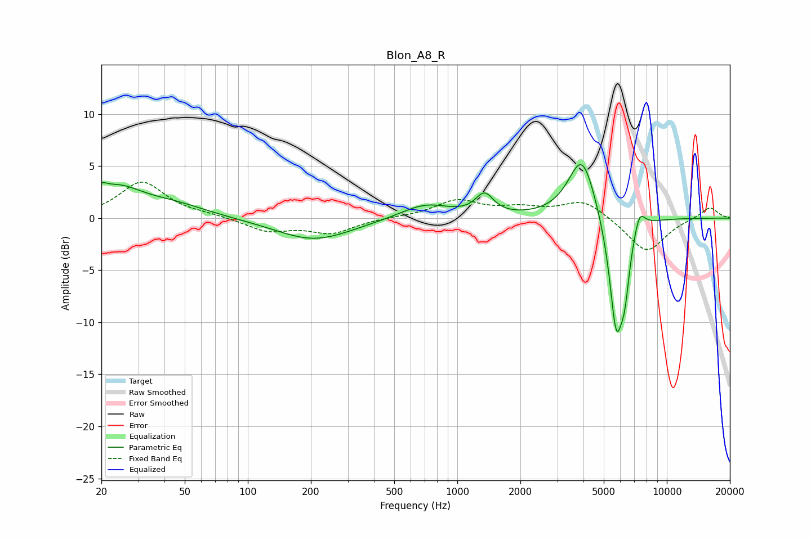

# Blon_A8_R
See [usage instructions](https://github.com/jaakkopasanen/AutoEq#usage) for more options and info.

### Parametric EQs
Apply preamp of -5.2 dB when using parametric equalizer.

|   # | Type    |   Fc (Hz) |    Q |   Gain (dB) |
|-----|---------|-----------|------|-------------|
|   1 | Peaking |        20 | 5.59 |         0.8 |
|   2 | Peaking |        24 | 1.2  |         2.6 |
|   3 | Peaking |        44 | 0.84 |         1.1 |
|   4 | Peaking |       207 | 0.78 |        -2.1 |
|   5 | Peaking |       704 | 1.19 |         1.4 |
|   6 | Peaking |      1348 | 3.36 |         2   |
|   7 | Peaking |      3941 | 2.13 |         6.2 |
|   8 | Peaking |      5734 | 3.96 |       -11   |
|   9 | Peaking |      6298 | 5.96 |        -4   |
|  10 | Peaking |      7406 | 5.14 |         1.9 |

### Fixed Band EQs
When using fixed band (also called graphic) equalizer, apply preamp of **-3.6 dB** (if available) and set gains manually with these parameters.

|   # | Type    |   Fc (Hz) |    Q |   Gain (dB) |
|-----|---------|-----------|------|-------------|
|   1 | Peaking |        31 | 1.41 |         3.5 |
|   2 | Peaking |        62 | 1.41 |         0.2 |
|   3 | Peaking |       125 | 1.41 |        -1.2 |
|   4 | Peaking |       250 | 1.41 |        -1.4 |
|   5 | Peaking |       500 | 1.41 |         0.1 |
|   6 | Peaking |      1000 | 1.41 |         1.6 |
|   7 | Peaking |      2000 | 1.41 |         0.8 |
|   8 | Peaking |      4000 | 1.41 |         1.7 |
|   9 | Peaking |      8000 | 1.41 |        -3.3 |
|  10 | Peaking |     16000 | 1.41 |         1.1 |

### Graphs

